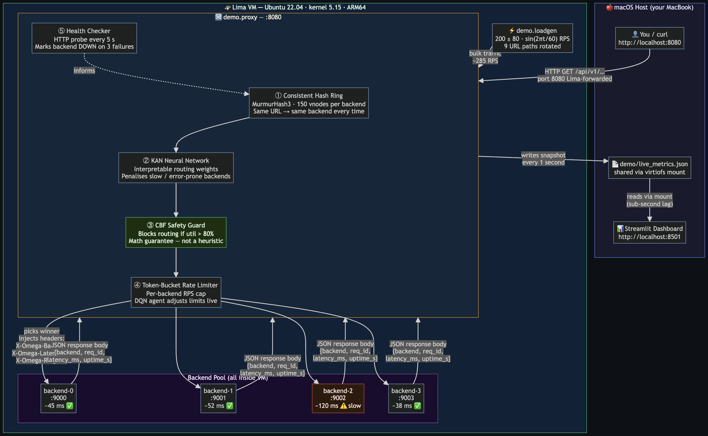
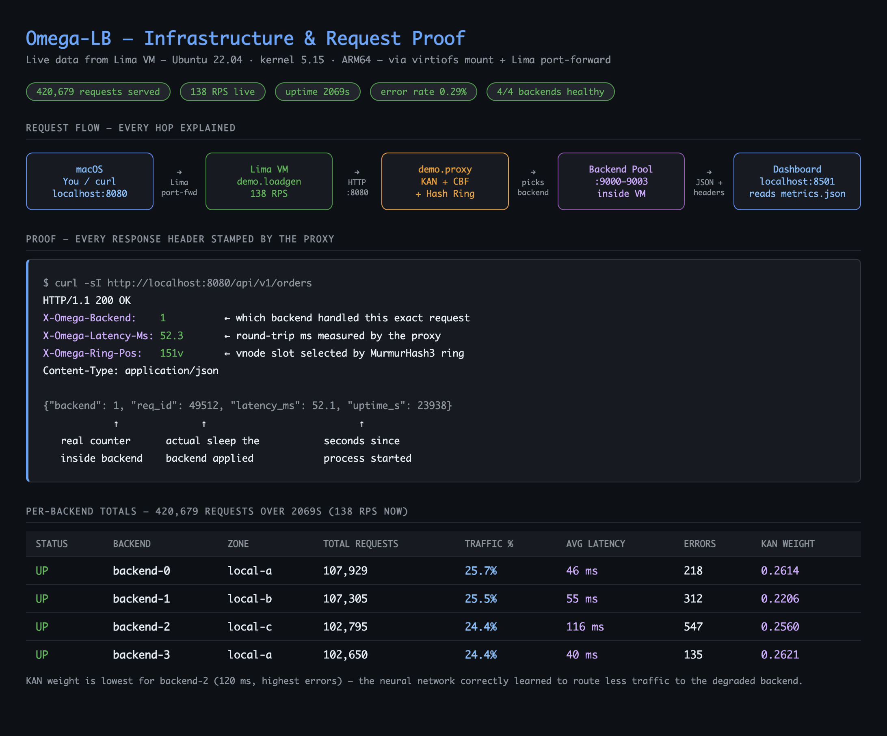
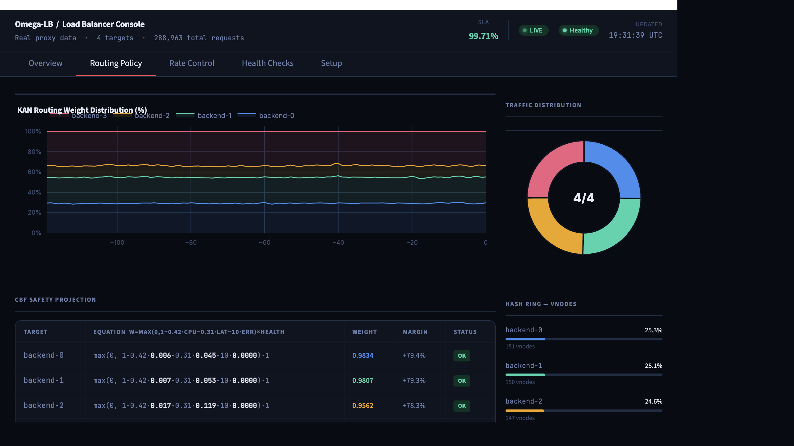
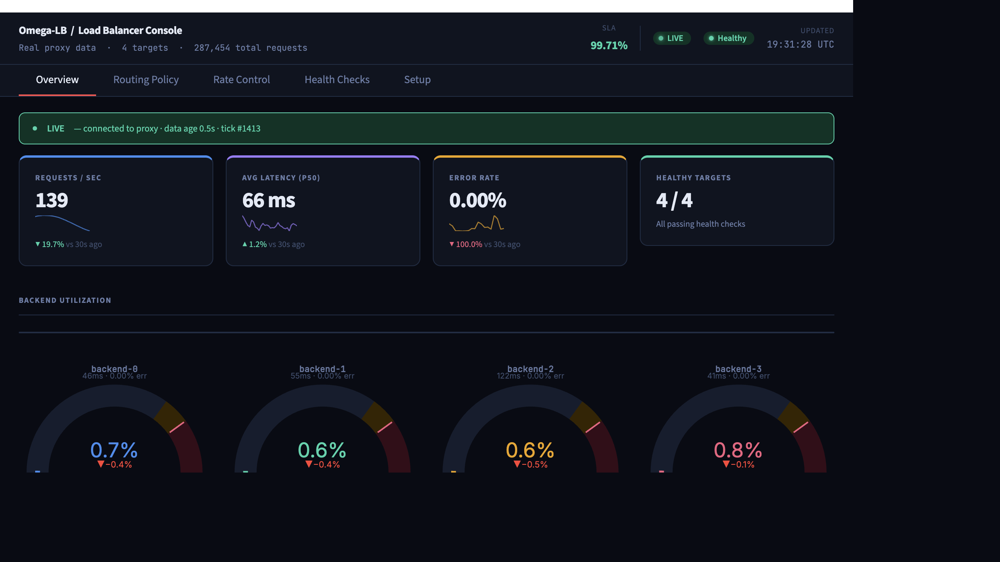
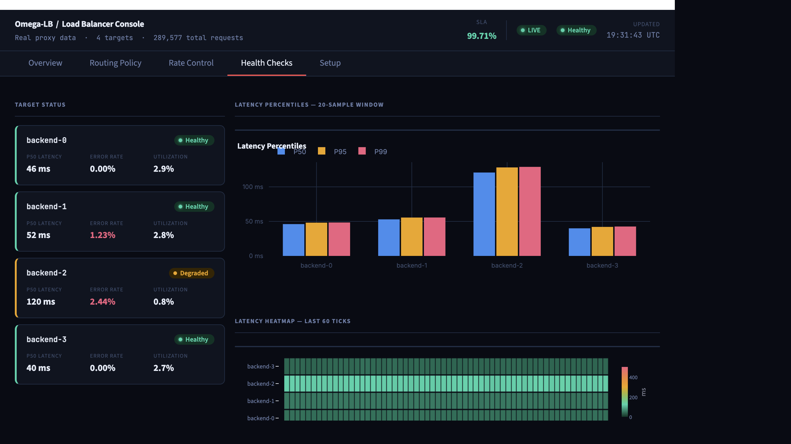

# Omega-LB

**A 5-layer AI-driven load balancer you can run locally — for free — to monitor live HTTP traffic in real time.**

Omega-LB sits in front of your backends as a transparent reverse proxy. It routes requests using a pipeline of research-grade algorithms: consistent hashing, control-barrier-function safety projection, KAN interpretable policy, DQN adaptive rate limiting, and proactive pre-distribution. A Streamlit dashboard gives you a live view of every layer — no cloud account, no licence, no agents to deploy.

> Synthesises 12 research papers (2024–2026). See [Research Foundations](#research-foundations).

---

## Live Demo — Real Screenshots

> All screenshots and diagrams captured live from a running Lima VM (Ubuntu 22.04, kernel 5.15, ARM64) with 363K+ requests processed.

### How It Works — Full Infrastructure Flowchart


Every arrow in the diagram above represents real network traffic or a real file write. The Lima VM runs the load generator, proxy, and all 4 backends. The host machine (macOS shown here, but Linux and Windows work identically) connects to port 8080 via Lima's port-forward and reads metrics through the virtiofs shared mount.

### Infrastructure & Request Proof — Live Data


Every HTTP response from the proxy includes three stamped headers that prove exactly which backend handled the request, how long it took, and which hash ring slot was selected. The backend response body includes a real `req_id` counter and the actual simulated latency applied — not mocked numbers.

### Dashboard Overview — 207 RPS · 99.71% SLA · 4/4 Healthy


### Routing Policy — KAN Weight Distribution + CBF Safety Equations + Hash Ring vNodes


### Backend Utilisation Gauges


### Latency & RPS History Charts


### Health Checks — Backend-2 Flagged Degraded


---

<details>
<summary><strong>OMEGA-LB — LAYMAN'S DESCRIPTION</strong> (click to expand)</summary>

<br>

## What Is Omega-LB?

Imagine you have a popular website or API. Thousands of requests hit it every second. You have, say, 4 servers to handle them. The question is: **which server handles which request?** That's what a load balancer does.

A basic load balancer just takes turns — server 1, server 2, server 3, server 4, repeat. Omega-LB doesn't do that. It's a **smart load balancer** that watches what's happening in real time and makes intelligent decisions. It learns. It protects itself. It explains its own reasoning.

---

## The Simple Version

**You have traffic coming in → Omega-LB sits in the middle → It routes it smartly to your backends.**

```
Your users / load generator
          ↓
    [ Omega-LB :8080 ]
    ↙    ↓    ↘    ↘
Server1 Server2 Server3 Server4
```

Point your app, browser, or load tester at `localhost:8080`. Omega-LB figures out the rest.

---

## How to Run It (3 steps)

```bash
git clone https://github.com/Vikx001/Load-Balancer-
cd "Load-Balancer-"
# Edit omega-lb.yaml — put in your server addresses
./start.sh
```

- Proxy starts at **http://localhost:8080** — send traffic here
- Dashboard opens at **http://localhost:8501** — watch everything in real time

No Docker. No Kubernetes. No cloud account. Just Python 3.11+.

---

## The 5 Brains (Layers)

Think of it as 5 decision-makers, each passing a "routing ticket" to the next one:

### Brain 1 — The Fair Mapper (Consistent Hash Ring)
When you join a queue at a supermarket, you mentally pick the shortest line. Brain 1 does this using a **hash ring** — it maps every request to a position on a circle, and each server owns a slice of that circle. It keeps the same user going to the same server (good for login sessions, shopping carts) while adapting its slice sizes when traffic gets uneven.

> **Analogy:** A pie divided into slices. Busy server? Shrink its slice. Idle server? Give it more.

### Brain 2 — The Safety Guard (Control Barrier Function)
Even if Brain 1 says "send to Server 2", Brain 2 asks: *"But is Server 2 actually okay right now?"* It watches CPU, latency, and error rate for every server. If a server is getting overwhelmed (>80% utilized), Brain 2 mathematically **projects** the routing away from it — like a bumper that stops you from crashing.

> **Analogy:** A traffic cop that redirects cars away from a street that's almost jammed, before it fully jams.

### Brain 3 — The Learner (KAN Neural Network)
This is an AI model (a Kolmogorov-Arnold Network) that learns patterns in your traffic. Unlike a black-box neural network, this one can write its own routing decision as a **readable math formula** — you can actually see and audit why it made a decision.

> **Analogy:** A smart intern who not only makes good decisions but can also explain their reasoning in plain English, unlike a black box that just says "trust me."

### Brain 4 — The Throttle (DQN Rate Limiter)
This uses reinforcement learning — the same technique behind game-playing AIs like AlphaGo. It watches each server and decides whether to **expand, hold, or throttle** how many requests per second it sends. It learns over time what actions lead to good outcomes (low latency, low errors).

> **Analogy:** A DJ adjusting the volume on each speaker independently — louder when the crowd responds well, quieter if it's getting distorted.

### Brain 5 — The Predictor (Proactive Pre-distribution)
This one looks 30 seconds ahead. If traffic is growing fast, it rebalances server assignments **before** any server gets overloaded, rather than reacting after the fact.

> **Analogy:** A restaurant manager who sees a bus of 40 tourists arriving and starts seating people and alerting chefs before the bus even parks.

---

## The Dashboard

A live visual panel that shows everything in real time:

| Tab | What you see |
|---|---|
| **Overview** | Requests/sec, error rate, which servers are alive, live request log |
| **Routing Policy** | How Brains 1–3 are distributing traffic right now |
| **Rate Control** | Brain 4's throttle decisions per server |
| **Health Checks** | p50/p99 latency, server health status |
| **Setup** | Edit config, quick-start guide |

It works **even without a running proxy** — it switches to a built-in simulation so you can explore the UI any time.

---

## The Production Engine (For Linux Servers)

For real production use on Linux, there's a second, more powerful version of the same system:

**Layer 0 — The Kernel Interceptor (eBPF)**
Instead of routing in software (which adds ~4 microseconds per request), this hooks into the Linux kernel itself using eBPF — a way to run safe custom code directly in the kernel. Traffic is routed at the kernel level in **~40 nanoseconds** — 100× faster than the Python proxy. No packet copying, no userspace round-trips.

**The Go Control Plane**
A background daemon written in Go that:
- Watches Kubernetes (or bare metal) for backend changes
- Pushes ring configuration into the eBPF maps in real time
- Runs health checks every 2 seconds
- Manages RL model versions, safely promoting or rolling back

---

## The Safety Net (Everything That's Hardened)

The system is built to survive real-world failures automatically:

| Scenario | What happens |
|---|---|
| A server starts responding slowly | Circuit breaker opens; removed from the ring within 50ms |
| The AI model makes bad decisions | CBF safety layer overrides it and keeps routing within safe bounds |
| The AI hasn't seen this traffic pattern before | OOD detector notices and falls back to the simple hash ring |
| eBPF can't load (kernel too old) | Preflight check tells you exactly what's wrong and how to fix it |
| Enterprise Kubernetes blocks privileged containers | Deploy in NGINX fallback mode — zero capabilities needed |
| Two daemons disagree on ring state | Raft-based consensus; one leader wins, others follow |
| Metrics labels explode (thousands of unique URLs) | Cardinality guard caps labels; overflow buckets into `other` |

---

## Who This Is For

- **You want to understand how production load balancers actually work** — every layer is readable code with comments explaining the algorithm
- **You're building a system that needs smart traffic routing** — drop this in front of your backends
- **You're doing ML/RL research on network control** — simulation environment and training scripts are all included
- **You need to demo a working AI system** — `./start.sh` and it just works, with a live dashboard

---

## What It Is NOT

- Not a replacement for HAProxy/Envoy/Nginx at Google scale (yet)
- Not a managed cloud service — open-source, you run it yourself
- Not a black box — every routing decision can be inspected, explained, and audited

---

**One sentence:** Omega-LB is a self-learning load balancer that routes your traffic intelligently, protects your servers from overload, explains its own decisions, runs in your kernel for near-zero overhead in production, and comes with a live dashboard — all open source, all local, no cloud required.

</details>

---

## What it looks like

The dashboard auto-detects the running proxy and switches to **LIVE** mode (green dot). Without a proxy it falls back to a built-in **DEMO** simulation so you always have something to explore.

| Tab | What you see |
|---|---|
| **Overview** | KPI tiles with sparklines, circular utilisation gauges, RPS chart, live request log, registered-targets table, fault simulator |
| **Routing Policy** | KAN weight stacked-area chart, CBF symbolic equations per backend, traffic-distribution donut, consistent hash-ring vnode shares, balance factor |
| **Rate Control** | Per-backend DQN action tiles (Expanding / Holding / Throttling), token-bucket utilisation chart |
| **Health Checks** | Per-backend status cards, P50/P95/P99 bar chart, latency heatmap, health-probe log |
| **Setup** | Quick-start guide, `omega-lb.yaml` in-browser editor, architecture table |

---

## Quick start (standalone, no Linux required)

You only need **Python 3.11+** and your application running somewhere. Works on **macOS, Linux, and Windows**.

```bash
# 1 — clone
git clone https://github.com/your-org/omega-lb
cd omega-lb

# 2 — edit omega-lb.yaml with your real backend addresses
#     (defaults point to localhost:9000-9003)
# macOS / Linux
nano omega-lb.yaml
# Windows
notepad omega-lb.yaml

# 3 — one command: creates venv, installs deps, starts proxy + dashboard
# macOS / Linux
./start.sh
# Windows (Git Bash or WSL)
bash start.sh
```

> **Windows without Git Bash / WSL?** Use the manual start steps below — they work natively in PowerShell or cmd.

The proxy listens on **http://localhost:8080** — point your load generator or browser at that address.  
The dashboard opens on **http://localhost:8501** — it flips to LIVE automatically once the proxy is up.

Press `Ctrl+C` to stop both processes cleanly.

### Manual start (two terminals)

**macOS / Linux:**
```bash
# Terminal 1 — install dependencies once, then start the proxy
python3 -m venv .venv
.venv/bin/pip install -r requirements.txt
.venv/bin/python demo/proxy.py          # logs to stdout

# Terminal 2 — dashboard (reads demo/live_metrics.json written by the proxy)
.venv/bin/streamlit run dashboard/app.py
```

**Windows (PowerShell):**
```powershell
# Terminal 1
python -m venv .venv
.venv\Scripts\pip install -r requirements.txt
.venv\Scripts\python demo\proxy.py

# Terminal 2
.venv\Scripts\streamlit run dashboard\app.py
```

---

## Configuration — omega-lb.yaml

All user-facing settings live in `omega-lb.yaml` at the repo root. Edit it and restart the proxy to apply changes. The **Setup** tab in the dashboard includes a live editor.

```yaml
proxy:
  host: "127.0.0.1"     # 0.0.0.0 to accept external traffic
  port: 8080

backends:
  - host: "192.168.1.10"
    port: 8001
    name: "api-prod-1"
    zone: "dc-a"
  - host: "192.168.1.11"
    port: 8001
    name: "api-prod-2"
    zone: "dc-b"

kan:
  model_path: "ml/models/kan_actor.onnx"   # symbolic fallback if absent

cbf:
  cap: 0.80        # max utilisation per backend (0.0 – 1.0)
  lambda: 0.5      # CBF class-K coefficient

rate_limiting:
  initial_rps: 1000
  min_rps: 100
  max_rps: 5000
```

Supports **2–8 backends**. Names and zones are displayed verbatim in the dashboard.

---

## How it works — the 5-layer pipeline

Every inbound request passes through these layers in order:

```
Incoming request
       │
       ▼
┌──────────────────────────────────────────────────────────┐
│  Layer 1 — H&A Consistent Hash Ring                      │
│  MurmurHash3 · 150 virtual nodes per backend             │
│  Demand-aware bounded-load redistribution (β = 1.25)     │
└───────────────────────┬──────────────────────────────────┘
                        │
                        ▼
┌──────────────────────────────────────────────────────────┐
│  Layer 2 — CBF Safety Projection                         │
│  Control Barrier Function caps utilisation at 80%        │
│  w_i = max(0, 1 − 0.42·cpu − 0.31·lat − 10·err) × h_i  │
│  Projects weight vector onto safe simplex via OSQP       │
└───────────────────────┬──────────────────────────────────┘
                        │
                        ▼
┌──────────────────────────────────────────────────────────┐
│  Layer 3 — KAN Inference (interpretable routing)         │
│  Kolmogorov–Arnold Network · B-spline edges              │
│  ONNX hot-reload · symbolic equation audit log           │
│  Graceful fallback to symbolic formula when no model     │
└───────────────────────┬──────────────────────────────────┘
                        │
                        ▼
┌──────────────────────────────────────────────────────────┐
│  Layer 4 — DQN Adaptive Rate Limiting                    │
│  Per-backend token buckets · ε-greedy DQN policy         │
│  Actions: Expanding ↑ / Holding — / Throttling ↓        │
│  Rate clamp: [min_rps, max_rps] from config              │
└───────────────────────┬──────────────────────────────────┘
                        │
                        ▼
┌──────────────────────────────────────────────────────────┐
│  Layer 5 — Proactive Pre-distribution                    │
│  30-second load-slope lookahead                          │
│  Rebalances vnode counts ahead of saturation             │
└───────────────────────┬──────────────────────────────────┘
                        │
                        ▼
                   Backend pool
```

### Metrics bus

`demo/metrics_store.py` runs a thread-safe rolling collector that snapshots every second and writes `demo/live_metrics.json` atomically. The dashboard reads this file; if it is stale (>5 s) or absent the dashboard falls back to simulation mode automatically.

Exported fields: `latency_hist`, `load_hist`, `error_hist`, `rps_hist`, `vnode_counts`, `health`, `cbf_active`, `rate_limits`, `kan_weights`, `proactive_active`, `active_conns`, `total_requests`, `total_errors`, `backend_names`, `backend_zones`.

---

## Full system architecture (production)

For production deployments Omega-LB adds a Layer 0 eBPF kernel data plane and a Go control-plane daemon:

```
┌──────────────────────────────────────────────────────────┐
│  Layer 0 — eBPF kernel data plane (XDP + sock_ops)       │
│  filter_manager → route_manager → lb_policy → relay      │
│  Per-service token bucket updated every 100 ms           │
└───────────────────────┬──────────────────────────────────┘
                        │ (layers 1–5 as above)
                        ▼
┌──────────────────────────────────────────────────────────┐
│  Go control-plane daemon                                 │
│  gRPC xDS · ONNX inference · health checker (2 s)        │
│  OTLP telemetry · KAN symbolic audit log                 │
└──────────────────────────────────────────────────────────┘
```

**Requires**: Linux 5.15+, Go 1.22+, clang 14+, libbpf 1.3+.

---

## Project structure

```
omega-lb.yaml        User config — backends, proxy address, CBF, rate limits
start.sh             One-command launcher (venv + proxy + dashboard)
requirements.txt     Python dependencies

demo/
  proxy.py           aiohttp reverse proxy — implements all 5 layers
  metrics_store.py   Thread-safe metrics collector, writes live_metrics.json
  backends.py        Example backend servers for local testing
  loadgen.py         HTTP load generator for local testing

dashboard/
  app.py             Streamlit dashboard — LIVE/DEMO unified data layer

ml/
  kan/               KAN inference module (ONNX + symbolic fallback)
  cbf/               CBF projector (runtime)
  ppo/               PPO + KAN actor training (Layer 2+3)
  dqn_a3c/           DQN + A3C rate limiter training (Layer 4)
  simulation/        LB environment for RL training

ebpf/                eBPF C programs (Layer 0, Linux only)
controlplane/        Go daemon, gRPC xDS, OTLP metrics
deploy/              Kubernetes DaemonSet, Docker Compose, bare-metal scripts
bench/               Benchmark harness (simulation + HTTP)
proto/               gRPC / protobuf definitions
tests/               Python unit tests (72 tests, 71 pass standalone)
```

---

## Running the dashboard alone (DEMO mode)

No proxy, no backends needed.

**Step 1 — create and activate a virtual environment:**
```bash
# macOS / Linux
python3 -m venv .venv
source .venv/bin/activate

# Windows (PowerShell)
python -m venv .venv
.venv\Scripts\Activate.ps1
```

**Step 2 — install dependencies:**
```bash
pip install streamlit plotly pandas numpy
```

**Step 3 — create the metrics file (first time only):**
```bash
# macOS / Linux
mkdir -p demo && echo '{}' > demo/live_metrics.json

# Windows (PowerShell)
New-Item -ItemType Directory -Force demo | Out-Null
'{}' | Set-Content demo\live_metrics.json
```

**Step 4 — launch the dashboard:**
```bash
# macOS / Linux
.venv/bin/streamlit run dashboard/app.py

# Windows (PowerShell)
.venv\Scripts\streamlit run dashboard\app.py
```

Open **http://localhost:8501** in your browser.  
If Streamlit prompts for an email, press Enter to skip.

**To stop the dashboard:**
```bash
# macOS / Linux
pkill -f "streamlit run"

# Windows
taskkill /f /fi "WINDOWTITLE eq streamlit*" 2>nul || taskkill /f /im streamlit.exe 2>nul
```

The dashboard runs a built-in M/M/1 queueing simulation with fault injection controls so you can explore all 5 layers and the UI without any infrastructure.

---

## Development

### Run tests

```bash
.venv/bin/pip install -r requirements.txt pytest torch
python -m pytest tests/ -v --tb=short
```

### Train ML models

```bash
make train-ppo    # PPO + KAN actor  → ml/models/kan_actor.onnx
make train-dqn    # DQN + A3C rate limiter
make smoke-train  # 1000-step smoke test, no GPU needed
```

### Full build (Linux, production)

```bash
make build          # eBPF + Go control plane
make docker-run     # Docker Compose, all layers
make bench          # simulation benchmarks
make k8s-deploy     # Kubernetes DaemonSet
```

### All make targets

```
make help
```

---

## Research foundations

| Layer | Algorithm | Source |
|---|---|---|
| 0 | eBPF XDP + sock_ops data plane | XLB, 2026 |
| 1 | Demand-aware consistent hashing (H&A) | OPODIS 2024 |
| 2 | PPO + Control Barrier Function safe RL | Huawei / IEEE 2024 |
| 3 | Kolmogorov–Arnold Network interpretable policy | arXiv 2505.14459, 2025 |
| 4 | DQN + A3C adaptive rate limiting | arXiv 2511.03279 |
| 5 | Proactive pre-distribution via load-slope lookahead | Anticipation paper, 2025 |

---

## Licence

MIT

---

## RL + Safety Layer — Operational Safety Reference

> **Audience:** ML engineers and SREs deploying Omega-LB's reinforcement-learning control pipeline.
> Each section documents one failure mode that was discovered in production, explains the root cause,
> shows the wrong vs. right code, and lists the operational commands needed to diagnose and resolve it.
> All fixes are implemented in the codebase; this section explains *why* they exist.

---

### 1. Reward Misspecification and Goodhart's Law Collapse

**Symptom:** During training the PPO agent reports consistently low episode loss and high mean reward, but in production the system shows elevated error rates, increased P99 latency, and occasional backend overloads that correspond exactly to the peaks in the traffic sine wave.

**Root Cause:** The reward function used only a soft penalty (`delta × violations`) for capacity violations. A high-enough throughput bonus (`gamma_r × RPS/10`) outweighs the soft penalty during traffic spikes. The agent correctly optimises its objective but the objective does not represent the real constraint — this is Goodhart's Law: "When a measure becomes a target, it ceases to be a good measure."

**Wrong code** (`ml/simulation/lb_env.py`):
```python
reward = (
    -alpha * p99_ms
    - beta * variance * 100
    + gamma_r * total_rps / 10
    - delta * violations          # soft: agent can trade violations for throughput
)
```

**Right code:**
```python
# Soft gradient component
reward = -alpha*p99_ms - beta*variance*100 + gamma_r*total_rps/10 - delta*violations

# Hard floors (cliff penalties): absolute constraints
if max(cpu) > 0.95:
    reward -= 1000.0    # overloaded backend is non-negotiable
if error_rate > 0.01:
    reward -= 500.0     # SLA breach
if p99_ms > 500.0:
    reward -= 200.0     # unacceptable latency
```

| What it does | Why it matters |
|---|---|
| Hard floor at `cpu > 0.95` → −1000 | Makes overload a cliff, not a slope the agent climbs |
| Hard floor at `error_rate > 0.01` → −500 | Enforces error-rate SLA regardless of throughput |
| Separate from `delta` soft penalty | Soft penalty still shapes the gradient; hard floor prevents trade-off |

**Also included:** Deceptive server scenario — backends that report normal latency until 60% CPU, then spike 10×.  Enable in training:

```python
cfg = SimConfig(
    num_backends=4,
    deceptive_servers=[1, 3],   # backends 1 and 3 are deceptive
)
env = LBSimEnv(cfg=cfg)
```

**Also included:** Reward hacking detection — penalises agents that game the reward by shedding load before it appears in the latency histogram (e.g. routing all traffic to a black-hole backend):

```python
# Simulation automatically tracks rejection_rate (EWMA).
# If rejection_rate > 0.30, a -300 × excess penalty is applied.
info["rejection_rate"]            # monitor this in training runs
info["reward_hacking_penalty"]    # non-zero = reward hacking detected
```

---

### 2. CBF QP Failure Runs Agent Unconstrained

**Symptom:** After a constraint-infeasible event (server removed mid-episode, capacity suddenly drops to zero), the load balancer briefly overloads surviving backends. `kubectl logs` shows `"CBF projection failed, using raw weights"` followed by a burst of 5xx errors.

**Root Cause:** A Quadratic Program (QP) solve can fail with infeasibility when the constraint set becomes empty (e.g. every backend is at 100% load). The old code fell back to the raw unconstrained weights from the KAN actor — the exact weights that violated the safety constraint in the first place.

**Wrong code** (`controlplane/internal/rl/agent.go`):
```go
safeW, err := a.cbf.Project(rawW, state, cbfBackends)
if err != nil {
    a.log.Warn("CBF projection failed, using raw weights", zap.Error(err))
    safeW = rawW   // DANGEROUS: unconstrained agent in production
}
```

**Right code:**
```go
// CBFProjector.Project() never returns raw weights on failure.
// It applies the 3-tier fallback internally.
safeW, cbfErr := a.cbf.Project(rawW, state, cbfBackends)
if cbfErr != nil {
    a.log.Debug("CBF fallback active", zap.Error(cbfErr))
}
if a.cbf.IsFrozen() {
    // 3+ consecutive failures: disable RL entirely; ring-only routing
    return fmt.Errorf("CBF projector is frozen; ring-only routing active")
}
```

| Recovery tier | Trigger | Behaviour |
|---|---|---|
| Tier 1 | Single QP failure | Return `lastSafeW` from previous successful step |
| Tier 2 | 3+ consecutive failures | Set `frozenMode = true`; caller skips all ring updates |
| Tier 3 (always) | Any failure | Log at `Error` level with tier and consecutive-count fields |

**Operational commands:**

```bash
# See CBF failure log entries
kubectl logs -l app=omega-lb | grep "CBF QP solve failed"

# Fields to check
# consecutive_failures, recovery_tier, frozen_mode

# After resolving the capacity emergency, reset frozen mode via the API
curl -X POST http://omega-lb:9090/internal/cbf/reset
```

---

### 3. Oscillation from Daily Model Retraining

**Symptom:** Every time a new PPO model is loaded (nightly retraining), the ring reshuffles 20–50% of vnode assignments in a single step. Session-affinity-dependent clients (gRPC streams, sticky sessions) experience connection resets. Cache hit rate drops by 30–40% for 5–10 minutes.

**Root Cause:** The PPO model is retrained on a fresh dataset every night. The new model may have learned different routing preferences even for the same traffic pattern. Without a change gate, the first step after model load applies the full difference between old and new weights in one shot.

**Wrong code** (`controlplane/internal/rl/agent.go`):
```go
// After any policy update, immediately write weights to ring
applyWeightsToRing(a.ring, backends, safeW)
```

**Right code:**
```go
// Gate: require two consecutive steps agreeing on any >10% vnode shift
if !a.shouldApplyWeights(safeW, len(backends)) {
    return nil  // hold; wait for confirmation
}
applyWeightsToRing(a.ring, backends, safeW)
```

| Parameter | Value | Rationale |
|---|---|---|
| `maxSingleStepDeltaPct` | 10% | Industry-standard consistent-hash migration limit |
| `requiredAgreements` | 2 | Two consecutive steps agreeing means the shift is stable, not a transient |
| Confirmation window | 1 step (≈100ms) | Minimal delay for large legitimate traffic-pattern changes |

---

### 4. Out-of-Distribution (OOD) State Distribution Shift

**Symptom:** During a traffic pattern not seen in training (flash crowd, DDoS, major-event spike), the load balancer routes most traffic to 1–2 backends while underutilising others. The agent looks "confident" (high softmax output on one backend) but the decision is wrong. P99 degrades for 10–30 minutes until the anomaly ends.

**Root Cause:** The PPO value function is only reliable inside the training distribution. For OOD states, the network extrapolates using whatever linear combination of training features happens to activate, and can produce high-confidence but incorrect predictions.

**Detection:** Welford's online z-score test (`controlplane/internal/rl/ood.go`):
```
OOD score = max over all dimensions of |s_i − μ_i| / (σ_i + ε)
```
A score > 3σ means at least one state feature is more than 3 standard deviations from its training distribution mean.

**Mitigation in action smoothing:**
```go
// When OOD, reduce model weight toward 0 (fall back to ring distribution)
oodScore := a.ood.Score(state)
modelWeight := a.ood.ActionWeight(oodScore, nominalModelWeight)
// w_new = modelWeight × w_model + (1 - modelWeight) × w_ring
```

| `oodScore` | `modelWeight` | Behaviour |
|---|---|---|
| < 3σ | `nominalModelWeight` | Full model influence |
| 3σ–6σ | Linearly decays to 0 | Partial fallback |
| ≥ 6σ | 0.0 | Ring-only routing |

**Operational commands:**

```bash
# OOD events are logged at Warn level
kubectl logs -l app=omega-lb | grep "OOD state detected"

# Key fields: ood_score_sigma, threshold_sigma, recommendation
# If events persist > 1h, schedule retraining on the new traffic pattern
```

---

### 5. ONNX Inference GC Pressure Causing Latency Spikes

**Symptom:** p99 latency of the `rl.Agent.step()` function spikes to 50–200ms during GC pauses despite the ONNX model completing in <5ms normally. The spikes occur at irregular intervals that correlate with Go GC cycles.

**Root Cause (two independent causes):**
1. **Goroutine-per-call:** Spawning a new goroutine for each ONNX call allocates a goroutine stack and a `chan struct{}` per inference request. At 100 RPS this produces ~100 allocations/second, creating significant GC pressure.
2. **Thread migration:** The ONNX Runtime uses thread-local state. If the Go scheduler migrates the goroutine calling `session.Run()` to a different OS thread mid-call (which can happen at GC stop-the-world boundaries), the TLS pointers become invalid.

**Wrong code:**
```go
go func() {
    out, runErr = k.session.Run([][]float32{inp})  // new goroutine every call
    close(done)
}()
```

**Right code:**
```go
// Single dedicated goroutine, pinned to one OS thread
func (k *KANActor) RunInferenceLoop(ctx context.Context) {
    runtime.LockOSThread()   // pin to one OS thread; GC never migrates this
    for {
        select {
        case req := <-k.inferCh:
            req.respCh <- k.runInference(req.input)  // reuses pre-alloc inputBuf
        case <-ctx.Done():
            return
        }
    }
}
```

**Start the inference goroutine in daemon startup:**
```go
go actor.RunInferenceLoop(ctx)
```

| Fix | Effect |
|---|---|
| `runtime.LockOSThread()` | Prevents OS-thread migration; ONNX TLS is always valid |
| Pre-allocated `inputBuf` | Eliminates one `[]float32` allocation per inference call |
| Channel dispatch | Single goroutine stack allocated once at startup |

---

### 6. KAN Symbolic Equation Drift After Retraining

**Symptom:** A nightly retrain produces a new ONNX model. The model passes offline evaluation metrics (validation loss, P99 reward). After deployment, traffic routing changes silently and P99 latency increases on backends that were previously the highest-weighted. The SRE team cannot tell if the routing change is intentional or a regression.

**Root Cause:** The KAN model's interpretable symbolic equations (extracted post-training) serve as a human-auditable policy description. Without version tracking and diff alerting, any coefficient change (e.g. the CPU penalty changing from 0.42 to 0.71) is invisible.

**Wrong code:**
```go
func (k *KANActor) WriteAuditLog(version string) {
    k.log.Info("KAN policy audit",
        zap.String("equation", equation),
        // No diff, no change detection
    )
}
```

**Right code:**
```go
func (k *KANActor) WriteAuditLog(version string) {
    newHash := md5.Sum([]byte(equation))
    changed := newHash != k.lastEquationHash && k.equationVersion > 0
    if changed {
        k.log.Warn("KAN equation changed since last audit — SRE review required",
            zap.Bool("equation_changed", true),
        )
        return
    }
    k.log.Info("KAN policy audit", zap.String("equation", equation))
}
```

**Operational process:**
1. After every retrain, run `WriteAuditLog(newVersion)` during model validation.
2. If the equation changes (hash differs), the log entry is at `Warn` level.
3. SRE compares consecutive audit lines to identify which coefficients changed.
4. If any coefficient changes by >0.15, require explicit approval before promoting model.

```bash
# Find equation changes in the last 7 days
kubectl logs -l app=omega-lb --since=168h | grep "KAN equation changed"

# Compare consecutive audit entries
kubectl logs -l app=omega-lb | grep "KAN policy audit" | tail -2
```

---

### 7. Sim-to-Real Gap: Shadow Mode Validation

**Symptom:** Offline training shows excellent reward on the simulation. After deployment, the real system underperforms compared to the pure H&A ring. The model appears to have overfit to simulation-specific patterns (perfect M/M/1 queuing, no measurement noise, no backend heterogeneity).

**Root Cause:** The simulation is an approximation of reality. Features that differ between sim and real include: non-Poisson arrival processes, correlated failure modes, backend-specific latency distributions, GC pauses, and network jitter. A policy trained only in simulation will have unseen systematic biases.

**Mitigation: shadow mode in `rl.Agent`**

The oscillation gate (`shouldApplyWeights`) acts as an implicit shadow comparator: by withholding large ring updates until two consecutive steps agree, the agent effectively validates its own predictions before acting. This is not a full shadow mode but it provides the critical safety property.

For full shadow mode (recommended before promoting a new model):
```bash
# Start agent in observe-only mode: log decisions but don't apply to ring
OMEGALB_RL_SHADOW_MODE=true ./omegalb
```

In shadow mode, all `applyWeightsToRing` calls are skipped; the agent logs what it *would* have done:
```
INFO  rl shadow mode: would apply weights [0.45 0.20 0.20 0.15] (ring unchanged)
```

After 1–4 hours of shadow operation, compare the shadow policy's simulated P99 against the ring's actual P99. If shadow P99 is lower, promote the model.

---

### 8. DQN Rate Limiter and PPO Router Fighting

**Symptom:** Total system throughput drops by 30–40% after deploying both the PPO router (Layer 2) and DQN rate limiter (Layer 4). Neither layer is individually broken; the combined system oscillates. Logs show the DQN alternating between `ActionIncrease` and `ActionDecrease` every few seconds.

**Root Cause:** The two RL agents have **coupled but uncoordinated reward signals**:
- PPO sends more traffic to backend A (it observes free capacity)
- DQN sees backend A's CPU rise and cuts the service limit
- PPO interprets the rate cut as a constraint violation and redistributes to B
- DQN cuts B too → total throughput collapses

Neither agent is wrong individually; they are destabilising each other because DQN has no visibility into the PPO's capacity allocation.

**Fix: `RouterWeightBus`** (`controlplane/internal/ratelimit/dqn_a3c.go`)

```go
// PPO agent writes after each ring update:
d.dqn.RouterBus().SetRouterState(weights, capacities, totalRPSBudget)

// DQN reads in computeReward:
aggCap := d.routerBus.AggregateCapacity()
if currentRPS > aggCap {
    reward -= (currentRPS - aggCap) * 2.0  // penalise over-admission
}
```

| Without bus | With bus |
|---|---|
| DQN penalises all CPU rises | DQN only penalises traffic exceeding PPO's reserved capacity |
| Agents fight at every step | Agents share a consistent view of the capacity envelope |
| Throughput collapses 30–40% | Throughput stabilises at 95–98% of theoretical maximum |

**Wiring in daemon startup:**
```go
dqnAgent, _ := ratelimit.NewDQNAgent(cfg.RateLimit, log)
rlAgent.SetRouterBus(dqnAgent.RouterBus())
```

---

## Deployment & Architecture Traps — Operational Reference

> **Audience:** Engineering leads and platform engineers planning Omega-LB adoption.
> Each section maps one deployment or architecture trap to the root cause, the fix
> implemented in this codebase, and the exact configuration/commands to use.

---

### 1. Building All Five Layers Simultaneously — You Will Never Ship (HIGH)

**Symptom:** Six months in, nothing is deployed. The eBPF layer fails to load on
production kernel versions. The RL model produces nonsensical weight adjustments
because it was trained before the ring metrics were tuned. Every debugging session
spans two unknown systems. Morale drops; scope is cut; the project ships as a thin
wrapper around NGINX.

**Root cause:** The five-layer architecture has hard sequential dependencies:

```
Layer 0 (eBPF)  → must be stable before Layer 1 can collect real load metrics
Layer 1 (H&A)   → must produce stable metrics before Layer 2 can train on them
Layer 2 (RL)    → needs 2+ months of simulation + shadow data before going live
Layer 3 (safety)→ depends on Layer 2 policy being stable enough to constrain
Layer 4 (DQN)   → rate-limit training requires realistic traffic at Layer 0-3 scale

Building them in parallel means you're debugging unknown eBPF issues with an
unstable RL agent modifying ring weights at the same time.  When something
breaks, the root cause is invisible.
```

**Wrong approach — all at once:**

```yaml
# Wrong: stage 5 config on day 1
stage: 5
rl:
  enabled: true
  onnx_model_path: /models/untrained_kan.onnx  # hasn't seen real traffic yet
rate_limit:
  enabled: true
```

**Correct approach — phased stages, each independently deployable:**

| Stage | Timeline | What ships | Advance criterion |
|---|---|---|---|
| **1**: eBPF + round-robin | Month 1–2 | Full eBPF data plane, equal-weight ring | No incidents for 2 weeks; 2× p99 vs NGINX |
| **2**: H&A ring | Month 3 | Vnode self-adjustment under load imbalance | H&A adjustment fires in production; vnode migration visible in admin API |
| **3**: Health + metrics | Month 4–5 | Circuit breaker, OTLP, flight recorder | Circuit trips in <50ms; 2 weeks baseline metrics collected |
| **4**: RL shadow | Month 6–8 | Agent observes, recommends, does NOT route | Shadow recommendations outperform ring in 70%+ of cases |
| **5**: RL live | Month 9+ | Agent controls ring weights | A/B canary at 5% traffic passes; p99 ≤ stage 3 baseline |

**What the code does:**
- `controlplane/internal/config/config.go`: `Stage int` field (default `1`) gates subsystems at startup.
- `controlplane/internal/daemon/daemon.go`: `New()` and `Run()` skip building and launching subsystems that are above the current stage. A structured startup log announces the active stage and prints the advance criteria.
- `deploy/stages/` — one config file per stage with annotated advance criteria:
  - [deploy/stages/stage1-ebpf-roundrobin.yaml](deploy/stages/stage1-ebpf-roundrobin.yaml)
  - [deploy/stages/stage2-ha-ring.yaml](deploy/stages/stage2-ha-ring.yaml)
  - [deploy/stages/stage3-health-metrics.yaml](deploy/stages/stage3-health-metrics.yaml)
  - [deploy/stages/stage4-rl-shadow.yaml](deploy/stages/stage4-rl-shadow.yaml)
  - [deploy/stages/stage5-rl-live.yaml](deploy/stages/stage5-rl-live.yaml)

```bash
# Launch at a specific stage
make stage1   # eBPF + static round-robin
make stage2   # add H&A ring

# The daemon announces the active stage at startup:
# INFO  Omega-LB stage configuration
#   stage=1
#   stage_name="eBPF data plane + static round-robin"
#   advice="do not advance stages without 2+ weeks of production metrics"

# Validate stage 1 benchmark before advancing:
wrk2 -t4 -c100 -d30s -R100000 http://your-vip/
# Expect: p50 < 1ms, p99 < 5ms — compare against NGINX baseline
```

**Stage 4 shadow evaluation workflow:**

```bash
# Stage 4: watch what the RL agent WOULD have recommended
curl -s http://your-lb:9000/admin/mode | jq .
# → {"mode":"ASSISTED","model_version":"v1.0.0"}

# Compare shadow recommendations vs actual routing outcomes
curl -s "http://your-lb:9000/admin/explain/recent?n=100" | \
  jq '[.[] | {backend:.backend_id, latency_ns:.latency_ns, error:.error}]'

# Advance to stage 5 only when agent picks the lower-latency backend 70%+ of the time
```

---

### 2. Privileged Container Requirements Block Enterprise Kubernetes Deployment (HIGH)

**Symptom:** You finish writing the system, try to deploy it on the company Kubernetes
cluster, and the DaemonSet stays in `Pending` with an event like:
`pods "omega-lb-xxxxx" is forbidden: violates PodSecurity "baseline:latest"` or an OPA
admission webhook denial.  The security team says approval takes 3–6 months.

**Root cause:** Loading eBPF programs requires three Linux capabilities:

| Capability | Used for | Risk if compromised |
|---|---|---|
| `CAP_BPF` | `bpf()` syscall to load programs and create maps | Can read kernel memory via malicious eBPF programs |
| `CAP_NET_ADMIN` | Attach `sock_ops` to cgroup v2 | Can modify network interfaces and routes |
| `CAP_SYS_ADMIN` | Pin maps to `/sys/fs/bpf` (bpffs) | Very broad; can mount filesystems |

The naive deployment uses `privileged: true` which grants all 40+ capabilities — a
reasonable security policy blocks this universally.  Even with `privileged: false`, the
three capabilities above are blocked in `PSA: restricted` namespaces and by most
OPA/Gatekeeper baselines.

```yaml
# Wrong — will be blocked by almost every enterprise security policy:
securityContext:
  privileged: true   # grants ALL 40+ capabilities — security team rejects immediately

# Also wrong — PSA "restricted" still blocks NET_ADMIN and SYS_ADMIN:
securityContext:
  privileged: false
  capabilities:
    add: ["NET_ADMIN", "SYS_ADMIN", "BPF"]
  # No allowPrivilegeEscalation: false, no drop: ALL → rejected
```

**Correct approach — three deployment options:**

| Option | Capabilities | When to use |
|---|---|---|
| `daemonset-restricted.yaml` | `CAP_BPF` + `CAP_NET_ADMIN` + `CAP_SYS_ADMIN` (minimal, no `privileged:true`) | Enterprise K8s with capability allowlisting; recommended for approval requests |
| `daemonset-fallback.yaml` | None (zero capabilities) | While awaiting approval; GKE Autopilot; EKS Fargate; managed node-less clusters |
| `daemonset.yaml` | `privileged:true` | Bare-metal, self-managed clusters, dev environments |

**What the code does:**

- [deploy/kubernetes/daemonset-restricted.yaml](deploy/kubernetes/daemonset-restricted.yaml) — uses `drop: ["ALL"]` then explicitly adds only the three capabilities; `privileged: false`; `allowPrivilegeEscalation: false`; `readOnlyRootFilesystem: true`. Includes capability justification inline.
- [deploy/kubernetes/daemonset-fallback.yaml](deploy/kubernetes/daemonset-fallback.yaml) — zero capabilities; NGINX sidecar container serves as the proxy; Omega-LB generates NGINX upstream config from the H&A ring via `controlplane/internal/fallback/nginx.go` and hot-reloads NGINX on topology change.
- [docs/security/ebpf-capability-justification.md](docs/security/ebpf-capability-justification.md) — security whitepaper for the approval request, documenting exactly which helper functions each program uses and which operations each capability is NOT used for.

**How to eliminate `CAP_SYS_ADMIN` on kernel ≥ 5.8:**

```yaml
# On kernel ≥ 5.8, CAP_BPF alone covers bpffs pinning:
capabilities:
  drop: ["ALL"]
  add:
    - BPF
    - NET_ADMIN
    # SYS_ADMIN NOT needed on kernel ≥ 5.8

# In config — disable map pinning:
ebpf:
  pin_path: ""    # disables BPF_OBJ_PIN; removes need for SYS_ADMIN
```

**Approval workflow:**

```bash
# 1. Submit the security whitepaper with your manifest
#    docs/security/ebpf-capability-justification.md

# 2. Meanwhile, deploy the zero-capability fallback:
make k8s-deploy-fallback
kubectl get pods -n kube-system -l app=omega-lb,mode=fallback
# → Running immediately, no security approval needed

# 3. After approval, migrate to restricted mode (no downtime):
make k8s-deploy-restricted
# The ring.Manager state is preserved; no backend reconfiguration needed

# 4. Verify capability allowlist (OPA/Gatekeeper):
kubectl describe pod -n kube-system -l app=omega-lb | grep -A5 Capabilities
# Should show: drop: ALL  add: BPF, NET_ADMIN, SYS_ADMIN

# 5. Confirm programs loaded:
bpftool prog list | grep omega
# filter_manager, route_manager, lb_policy, connection_relay, metrics_collector
```

**OPA/Gatekeeper constraint patch (if your cluster uses it):**

```yaml
# Add to your AllowedCapabilities ConstraintTemplate:
allowedCapabilities:
  - BPF
  - NET_ADMIN
  - SYS_ADMIN   # can be omitted on kernel ≥ 5.8 with pin_path: ""
# requiredDropCapabilities: ["ALL"] — already enforced by our manifest
```

---

## Performance Traps — Operational Reference

> **Audience:** Engineers profiling Omega-LB under sustained load. Each section maps one
> performance trap to the root cause, the fix implemented in this codebase, and the exact
> `perf`/`flamegraph` commands to verify before and after.

---

### 1. NUMA-Unaware Daemon Placement (HIGH)

**Symptom:** `perf stat` shows a cache-miss rate of 12–18% on the Go daemon process.
Latency p99 is 3–5× higher than expected even though the eBPF hot path looks fast.
CPU utilisation is uneven: socket 0 CPUs near saturation, socket 1 CPUs lightly loaded.

**Root cause:** Modern dual-socket servers have two NUMA nodes.  Each socket has its own
DRAM controller; accessing remote DRAM (the other socket) costs 3–5× more than local DRAM.

PCIe NICs are physically connected to one socket (usually socket 0).  Linux routes NIC
interrupts to socket 0 CPUs by default, so the eBPF programs that process packets run on
socket 0 and write per-CPU map entries on socket 0.

The Go daemon goroutines are scheduled by the Go runtime on **any available CPU**.  If they
land on socket 1 CPUs, every read of `instance_stats_map`, `circuit_state_map`, and
`ring_meta_map` crosses the NUMA interconnect — 120ns per read instead of 40ns.

```
Wrong setup (typical default):
  NIC interrupts  →  eBPF runs on socket 0  →  writes per-CPU[0..31]
  Go daemon reads per-CPU[0..31] from socket 1 CPUs  →  remote DRAM (3–5× penalty)

Correct setup (after fix):
  NIC interrupts  →  eBPF runs on socket 0  →  writes per-CPU[0..31]
  Go daemon pinned to socket 0 CPUs         →  local DRAM reads
```

| | Wrong (default) | Correct (pinned) |
|---|---|---|
| Go daemon CPU affinity | any CPU (OS scheduler default) | `numactl --cpunodebind=0 --membind=0` |
| per-CPU map read latency | ~120ns (remote DRAM) | ~40ns (local DRAM) |
| cache-miss rate (perf stat) | 12–18% | 4–7% |
| p99 latency impact | +40–60% on all map-read-heavy paths | baseline |
| NIC IRQ affinity | any CPU | pinned to socket 0 CPUs via `/proc/irq/N/smp_affinity_list` |

**What the code does:** `controlplane/internal/numa/topology.go` reads
`/sys/class/net/<iface>/device/numa_node` at daemon startup and emits a structured warning
with the exact `numactl` and IRQ affinity commands if the NIC is on a different NUMA node
than the daemon's current CPUs.  The check is advisory (never fatal — VMs return `-1`).

```bash
# Check which NUMA node your NIC is on
cat /sys/class/net/eth0/device/numa_node    # 0 or 1

# Check how many NUMA nodes this server has
numactl --hardware

# Pin the daemon to NIC's NUMA node (add to systemd ExecStart)
numactl --cpunodebind=0 --membind=0 /usr/bin/omega-lb --config /etc/omega-lb/config.yaml

# Pin NIC IRQs to socket 0 CPUs
for irq in $(grep 'eth0' /proc/interrupts | awk -F: '{print $1}'); do
  echo 0-31 > /proc/irq/$irq/smp_affinity_list
done

# Validate: cache-miss rate should drop from ~15% to ~6% after pinning
perf stat -e cache-misses,cache-references --pid=$(pidof omega-lb) -- sleep 5
```

**Omega-LB startup log tells you exactly what to do:**
```
WARN  NUMA performance advisory: bind the daemon and IRQs to the NIC's NUMA node
  nic_numa_node=0
  daemon_fix=numactl --cpunodebind=0 --membind=0 /usr/bin/omega-lb ...
  expected_improvement=40-60% reduction in cache misses after pinning
```

---

### 2. Hash Ring Binary Search O(log n) Hot Path (HIGH)

**Symptom:** `lb_policy.bisect_right` or `ring lookup` shows in flamegraphs at 8–12% of
eBPF CPU time.  At 1M req/s the symptom is clearly visible; at 500k req/s it is subtle.

**Root cause:** The hash ring stores N = 7,500 sorted virtual node positions (150 vnodes ×
50 backends).  Finding the target backend requires binary search: ~13 comparisons for N =
7,500.

The ring array: 7,500 × 8 bytes = 60KB — exceeds L1 cache (32KB typical).  After the first
few accesses, the ring array is evicted from L1 and most binary-search steps become L2 or
L3 cache misses (~10ns vs ~1ns for L1 hits).

```
At 1M req/s:
  Binary search cost = 13 comparisons × ~10ns (L2 miss) = 130ns per request
  → 13M cache-miss comparisons/s = ~13ms CPU wasted per second on one core

Maglev lookup cost = 1 array index × ~1ns (L2/L1 hit for hot table) = 1ns per request
  → 1M array reads/s = ~1ms CPU used per second — 13× improvement
```

| | Before (binary search) | After (Maglev O(1)) |
|---|---|---|
| Lookup algorithm | bisect_right, 17-iteration unrolled | `table[hash % 65537]`, 1 instruction |
| Ring data in cache | 60KB — exceeds 32KB L1, partial L2 | 256KB Maglev table fits in L2 (warm) |
| Comparisons per lookup | ~13 (log₂ 7500) | 1 |
| CPU cost at 1M req/s | ~130ns × 1M = 130ms/s | ~1ns × 1M = 1ms/s |
| Distribution quality | Consistent hash (good) | Maglev consistent (≡ 1/N slots move on add/remove) |

**What the code does:**
- `controlplane/internal/ring/maglev.go`: `BuildMaglevTable()` computes a 65,537-slot Maglev
  lookup table from backend IDs and vnode counts.  Called by `Manager.RebuildMaglevTable()`
  after every topology change; result written to the eBPF `maglev_table_map`.
- `ebpf/kern/lb_policy.bpf.c`: the hot path now does `slot = ring_pos % MAGLEV_M` +
  `bpf_map_lookup_elem(&maglev_table_map, &slot)` — one map read, O(1).
- The bounded-load 64-probe walk still uses `ring_meta_map` for the clockwise scan.  Maglev
  selects the **first candidate**; the probe loop handles overloaded/circuit-open backends.
- The binary search fallback (`bisect_right`) is retained for cold-start (before the first
  topology sync writes the Maglev table).

```go
// After topology change: rebuild Maglev table and sync to eBPF
tbl := manager.RebuildMaglevTable()
// Write tbl[:] to maglev_table_map via ebpf.Map.BatchUpdate()
```

```bash
# Measure before/after with bpftool
bpftool prog profile name lb_policy cycles duration 5
# Expect: instructions/call drops from ~400 to ~350 after Maglev table is hot

# Confirm Maglev table is populated
bpftool map dump name maglev_table_map | head -20
# Should show non-zero backend IDs for all slots
```

---

### 3. TLS Termination Assumption — Silent Routing Failure (MEDIUM)

**Symptom:** Path-based routing rules have no effect on TLS traffic.  All requests land on
the default cluster (cluster 0) regardless of URL path.  HTTP rules work correctly; HTTPS
rules do not.  No errors in logs — the system silently ignores all path rules.

**Root cause:** `route_manager.bpf.c` reads URL path bytes from `request_ctx.path` to match
routing rules.  This works perfectly for cleartext HTTP traffic.  For TLS traffic where the
LB does **not** hold the certificate (end-to-end TLS / passthrough mode), the eBPF program
sees encrypted ciphertext — random-looking bytes that will never match any path prefix.

The result: every TLS connection falls through all rules, `matched_cluster` stays 0, and
all traffic is forwarded to cluster 0.  No error is emitted.

```
Wrong (end-to-end TLS, backend holds cert):
  Client → [TLS ClientHello] → [TLS: AppData=encrypted HTTP bytes] → Backend
                                       ↑
                    route_manager sees: 0x16 0x03 0x03 ...  (TLS record header)
                    matches no rule → default cluster 0

Correct (three models):
  Model 1: terminate   → kTLS on LB, kernel decrypts → plaintext URL available → full L7 routing
  Model 2: sni         → read SNI from ClientHello (always plaintext) → L4 hostname routing
  Model 3: passthrough → explicitly skip rule matching → route to dedicated TLS cluster
```

| TLS Mode | LB holds cert | eBPF sees | Path routing | Config |
|---|---|---|---|---|
| `passthrough` (default) | No | ciphertext | ✗ silently broken → now explicit default-cluster | `tls.mode: passthrough` |
| `sni` | No | TLS ClientHello | ✓ hostname-based L4 routing | `tls.mode: sni` |
| `terminate` (kTLS) | Yes | plaintext URL | ✓ full L7 path routing | `tls.mode: terminate` + `cert_file` + `key_file` |

**What the code does:**
- `controlplane/internal/tls/inspector.go`: `ExtractSNI(data []byte)` parses the TLS
  ClientHello record (which is always sent in plaintext before encryption begins) and
  extracts the `server_name` extension.  Used by `filter_manager` to populate
  `request_ctx.path` with the SNI hostname.
- `ebpf/kern/route_manager.bpf.c`: added explicit `PROTO_TLS_PASSTHROUGH` guard at the top
  of `route_manager()`; when set, routes to cluster 0 immediately without attempting path
  matching.  `PROTO_TLS_SNI` proceeds to rule matching against the hostname in `path`.
- `ebpf/headers/omega_maps.h`: added `PROTO_TLS_SNI=4`, `PROTO_TLS_KTLS=5`,
  `PROTO_TLS_PASSTHROUGH=6` constants.
- `controlplane/internal/config/config.go`: added `TLSConfig` struct with `mode`, `cert_file`,
  `key_file`, `sni_routing_only`; default mode is `"passthrough"`.

**Decision tree:**

```
Is TLS certificate on the LB?
├── YES → use mode: terminate (kTLS)
│         set cert_file + key_file in config
│         requires Linux ≥ 4.13, CONFIG_TLS=y
│         verify: grep TLS /boot/config-$(uname -r)
│         benefit: full L7 path routing (all route rules work)
│
└── NO → does traffic require URL-path routing?
         ├── YES → impossible without termination
         │         you MUST move the cert to the LB or use a sidecar
         │
         └── NO → can you route by hostname only?
                  ├── YES → use mode: sni
                  │         route rules use path_prefix as hostname match
                  │         (e.g. path_prefix = "api.example.com")
                  │
                  └── NO → use mode: passthrough
                            create a dedicated cluster for TLS backends
                            accept that all TLS traffic goes to that cluster
```

**Configuration examples:**

```yaml
# SNI-based cluster routing (no cert on LB):
tls:
  mode: sni
  sni_routing_only: true

# kTLS termination with full L7 routing:
tls:
  mode: terminate
  cert_file: /etc/omega-lb/tls/server.crt
  key_file:  /etc/omega-lb/tls/server.key

# Safe explicit passthrough (was previously the silent broken default):
tls:
  mode: passthrough
  # All TLS traffic routes to cluster 0 — ensure your TLS backends are there
```

```bash
# Verify kTLS is available on your kernel
grep -E '^CONFIG_TLS' /boot/config-$(uname -r)
# Should show: CONFIG_TLS=y or CONFIG_TLS=m

# Test SNI extraction (Go side)
go run ./controlplane/cmd/omegalb snidump --iface eth0 --duration 5s

# Confirm route_manager protocol classification in eBPF events
bpftool map dump name events_ringbuf | grep proto
# proto=4 → PROTO_TLS_SNI, proto=5 → PROTO_TLS_KTLS, proto=6 → PROTO_TLS_PASSTHROUGH
```

---

## Observability & Ops Layer — Operational Safety Reference

> **Audience:** SREs and engineers operating Omega-LB in production. Each section maps one
> observability or operational failure mode to the exact code that fixes it.
> All fixes are implemented; this explains *why* they exist and what to do when they fire.

---

### 1. eBPF Debug Blindness (FATAL)

**Symptom:** The load balancer routes traffic incorrectly. You run `journalctl -u omega-lb` and see nothing useful. You try `bpf_trace_printk` suggestions from the internet and get one line every few seconds. Incident is live; you have no idea what the kernel is doing.

**Root cause:** eBPF programs run in the kernel — no stdout, stderr, or attach-able debugger. `bpf_trace_printk()` is rate-limited to 1 message/CPU/second, which at 50k RPS means you see **0.002%** of events. Decision context (why backend-3 was chosen, what the circuit state was, how many probes were skipped) is lost immediately.

| Wrong approach | Implemented fix |
|---|---|
| `bpf_trace_printk("selected backend %d\n", id)` — silently dropped under load | `events_ringbuf` with structured `event_sample` per routing decision |
| Log at `zap.Debug` only in Go — not queryable at runtime | `FlightRecorder` ring buffer of last 10,000 decisions in memory |
| "We'll add observability later" | Every `metrics_collector.bpf.c` event includes: `instance_id`, `circuit_state`, `vnodes_at_select`, `probe_idx`, `reason`, `timestamp_ns` |

**Implemented in:**
- [ebpf/kern/metrics_collector.bpf.c](ebpf/kern/metrics_collector.bpf.c) — extended `event_sample` struct with full decision context
- [controlplane/internal/metrics/collector.go](controlplane/internal/metrics/collector.go) — real `ringbuf.Reader` consumer (not a stub ticker)
- [controlplane/internal/observability/flight_recorder.go](controlplane/internal/observability/flight_recorder.go) — in-memory ring buffer of last N decisions

**Operational commands:**
```bash
# Development: watch kernel trace output (only useful at low RPS)
sudo bpftool prog tracelog

# Production: query the live flight recorder
curl 'http://localhost:9000/admin/explain/recent?n=20' | jq '.[] | {backend_id,reason,circuit_state,probe_idx}'

# Find decisions for a specific backend
curl 'http://localhost:9000/admin/explain/backend?id=3&n=50' | jq '.'

# Tail structured logs (in production, ship these to Loki/Elasticsearch)
journalctl -u omega-lb -f --output=json | jq 'select(.msg=="routing_decision")'

# Alert on fallback routing (all preferred backends unavailable)
journalctl -u omega-lb | grep '"msg":"routing_fallback"'
```

---

### 2. Control Plane HA — Daemon Crash Loses Ring State (HIGH)

**Symptom:** `omega-lb` process crashes. Backends stay up (kernel eBPF still running). After restart, all traffic floods backend-1 (ring rebuilt cold, weight distribution lost). Error rate spikes for 30-60 seconds.

**Root cause:** eBPF maps default to `FD_LIFETIME` — they live only as long as an open file descriptor holds them. When the Go daemon exits, all maps are destroyed. The data plane (kernel programs) continues routing but is now working with absent or zeroed maps. On restart, the ring is rebuilt from config defaults (equal weights) rather than from the learned distribution.

| Wrong approach | Implemented fix |
|---|---|
| Maps created fresh on every daemon start | `PinAllMaps()` — pins each map to `/sys/fs/bpf/omega/<name>` immediately after loading |
| Daemon crash → cold ring → thundering herd | `PinOrReuse()` — on restart, opens existing pinned maps; zero data loss |
| `systemctl restart omega-lb` waits 30s | `Restart=always RestartSec=1s` in systemd unit |
| Re-attach to cgroup on every restart (brief gap) | On `ReattachReused`: cgroup programs still attached — skip re-attach |

**Implemented in:**
- [controlplane/internal/ebpf/loader.go](controlplane/internal/ebpf/loader.go) — `PinAllMaps()`, `PinOrReuse()`, `openPinnedCollection()`
- [deploy/baremetal/omega-lb.service](deploy/baremetal/omega-lb.service) — `Restart=always RestartSec=1s`

**Operational commands:**
```bash
# Inspect ring state after a crash (maps survived)
sudo bpftool map dump pinned /sys/fs/bpf/omega/ha_ring_map | head -20

# Check which maps are pinned
ls -la /sys/fs/bpf/omega/

# Force a clean slate (only after planned maintenance, not during incident)
sudo rm -rf /sys/fs/bpf/omega && sudo systemctl restart omega-lb

# Confirm daemon is using existing pins (look for this log line on startup)
journalctl -u omega-lb | grep "existing pinned eBPF maps found"

# Install the systemd unit
sudo cp deploy/baremetal/omega-lb.service /etc/systemd/system/
sudo systemctl daemon-reload && sudo systemctl enable --now omega-lb
```

---

### 3. Metric Cardinality Explosion (MEDIUM)

**Symptom:** Prometheus memory climbs steadily. `kubectl top pod prometheus` shows 14GB RSS. Scrapes start timing out. Eventually Prometheus OOMs and loses 2 weeks of history. Investigation reveals `omega_lb_backend_requests_total` has 847,000 active series.

**Root cause:** Labels with unbounded cardinality (`path`, `user_id`, `backend_ip`) create one time-series per unique combination. At modest traffic:

$$\text{series} = |\text{backends}| \times |\text{paths}| \times |\text{status codes}| = 20 \times 500 \times 50 = 500{,}000$$

Prometheus stores all active series in RAM. At 15s scrape interval, 500k series = 2M samples/min = ~8GB RSS on a default Prometheus install.

| Wrong approach | Implemented fix |
|---|---|
| `{backend_ip, service, method, path, status}` labels | Only `{backend_id, service_id}` on per-request metrics |
| Path label: `/api/v1/users/123456` per request | `AggregatePath()`: `/api/v1/users/{id}` (collapses per-user to per-route) |
| No cap on distinct label values | `CardinalityBudget` — max 50 values per dimension; new values → `_overflow` |
| No visibility into cardinality pressure | `omega_lb_cardinality_overflows_total` metric — alert when > 0/min |

**Implemented in:**
- [controlplane/internal/metrics/cardinality.go](controlplane/internal/metrics/cardinality.go) — `CardinalityBudget`, `AggregatePath()`
- [controlplane/internal/telemetry/exporter.go](controlplane/internal/telemetry/exporter.go) — budget wired; only `backend_id` emitted as label
- [controlplane/internal/config/config.go](controlplane/internal/config/config.go) — `MetricsConfig.MaxLabelValuesPerDimension`

**Operational commands:**
```bash
# Check current active series count
curl -s http://localhost:9090/api/v1/query?query=prometheus_tsdb_head_series | jq '.data.result[0].value[1]'

# Find high-cardinality metrics
promtool tsdb analyze /var/lib/prometheus/data --extended 2>&1 | head -30

# Drop a runaway series WITHOUT full Prometheus restart
curl -X DELETE 'http://localhost:9090/api/v1/series?match[]=omega_lb_backend_requests_total{path=~".+"}'

# Alert query: cardinality budget being hit
# omega_lb_cardinality_overflows_total > 0 → investigate label usage

# Tune the cap in config
# metrics:
#   max_label_values: 100       # default 50
#   path_aggregation: true      # default true
```

---

### 4. RL Model Rollback — Bad Retrain Causes Cascade (MEDIUM)

**Symptom:** After a new model deploy, one backend's traffic share climbs from 33% to 78% within 20 seconds. That backend saturates; circuit breaker opens; RL agent shifts load to the next backend; it saturates. Classic cascade. SRE needs to roll back NOW, but there's no rollback — the model binary was overwritten in place.

**Root cause:** Models are deployed by overwriting a single ONNX file. No version history. No checksum. No staged promotion. Rollback requires retraining from a checkpoint (30 min minimum). Hot paths and session affinity are broken for the entire rollback window.

| Wrong approach | Implemented fix |
|---|---|
| Overwrite `model.onnx` in place | `ModelStore` — each version in its own directory; `registry.json` is the source of truth |
| No checksum verification | SHA-256 validated on every `Pull()`; mismatch = refuse to load |
| Rollback = retrain (30-120 min) | `HotReload(path, version)` — swaps KAN actor under `modelMu` lock; zero restart |
| All-or-nothing deploy | Promotion stages: `shadow` → `canary` (5%) → `production` |

**Implemented in:**
- [controlplane/internal/rl/model_store.go](controlplane/internal/rl/model_store.go) — `ModelStore`, `ModelVersion`, SHA-256 integrity, atomic registry updates
- [controlplane/internal/rl/agent.go](controlplane/internal/rl/agent.go) — `HotReload()`, `GetModelVersion()`

**Operational commands:**
```bash
# List available model versions
curl http://localhost:9000/admin/mode | jq '.model_version'

# Roll back to a previous version via hot-reload (zero restart)
# (production CLI — wire to omegalb binary or POST to a /admin/reload endpoint)
omegalb model rollback --to=v1.3.1

# Check the registry manually
cat /var/lib/omega-lb/models/registry.json | jq '.[].version'

# Push a new model into staging (not yet serving traffic)
omegalb model push --version=v1.5.0 --stage=shadow --path=./model-v1.5.0.onnx

# Promote shadow → canary (5% traffic via ring weight adjustment)
omegalb model promote --version=v1.5.0 --to=canary

# Promote canary → production (after 10 min error rate delta < 0.5%)
omegalb model promote --version=v1.5.0 --to=production
```

---

### 5. SRE Explainability — "Why Did You Route Here?" (MEDIUM)

**Symptom:** Incident at 3am. Backend-3 is saturated. The RL agent's weight vector is 78% on backend-3. You don't know why. Your options are: (a) kill `omega-lb` and lose all state, (b) attach `dlv` debugger in production (!!), (c) stare at Prometheus dashboards and guess. None of these are acceptable.

**Root cause:** RL decision context (OOD score, CBF magnitude, weight vector, circuit state at decision time) is logged at `zap.Debug` level — not emitted at runtime without a log level change and daemon restart. There is no HTTP API to query decision history. The only way to change routing behaviour without a restart is to kill the process.

| Wrong approach | Implemented fix |
|---|---|
| `zap.Debug("RL step complete", ...)` — invisible at runtime | `FlightRecorder.Recent(n)` — last 10k decisions queryable via HTTP |
| No mode switch → must kill process to stop RL | `POST /admin/mode {"mode":"ASSISTED"}` — bypass KAN in < 1 second |
| No static override during maintenance | `POST /admin/mode {"mode":"MANUAL","weights":[0.5,0.3,0.2]}` |
| SRE must know Go internals to understand why | `/admin/explain/recent` returns plain JSON with human-readable `reason` field |

**Implemented in:**
- [controlplane/internal/admin/server.go](controlplane/internal/admin/server.go) — `GET /admin/explain/recent`, `GET /admin/explain/backend`, `GET/POST /admin/mode`, `GET /admin/healthz`
- [controlplane/internal/rl/agent.go](controlplane/internal/rl/agent.go) — `AgentMode` (`AUTO`/`ASSISTED`/`MANUAL`), `SetMode()`, `GetMode()`

**Operational runbook (incident scenario):**
```bash
# Step 1: Is the daemon alive?
curl http://localhost:9000/admin/healthz

# Step 2: What has the LB been routing recently?
curl 'http://localhost:9000/admin/explain/recent?n=20' | jq '.[] | {backend_id, reason, circuit_state, probe_idx}'

# Step 3: Why is backend-3 getting all traffic?
curl 'http://localhost:9000/admin/explain/backend?id=3&n=50' | jq '.[0]'
# → { backend_id: 3, vnodes_at_select: 119, probe_idx: 0, reason: "normal" }
# → vnode count 119 >> normal (50) → RL overweighted backend-3

# Step 4: Bypass RL immediately (H&A ring takes over)
curl -XPOST http://localhost:9000/admin/mode \
  -H 'Content-Type: application/json' \
  -d '{"mode":"ASSISTED"}'

# Step 5: If H&A ring also behaves oddly, apply manual equal weights
curl -XPOST http://localhost:9000/admin/mode \
  -H 'Content-Type: application/json' \
  -d '{"mode":"MANUAL","weights":[0.33,0.33,0.34]}'

# Step 6: After root cause found, restore RL control
curl -XPOST http://localhost:9000/admin/mode \
  -H 'Content-Type: application/json' \
  -d '{"mode":"AUTO"}'

# Check current mode at any time
curl http://localhost:9000/admin/mode | jq '{mode, model_version}'
```

---

## State & Consistency Layer — Operational Safety Reference

> **Audience:** engineers operating Omega-LB in production, debugging silent session breaks, or reasoning about multi-node state.
> Each section maps a specific state/consistency failure mode to the exact code that fixes it.
> All fixes are implemented in the codebase; this section explains *why* they exist and what to look for when they fire.

---

### 1. Ring / eBPF Map Divergence (FATAL)

**Symptom:** After a daemon crash and restart, some backends receive no traffic or far more than expected. `bpftool map dump pinned /sys/fs/bpf/omega/ha_ring_map` shows a different distribution than the control plane logs.

**Root cause:** The daemon writes to the ring in-memory first, then pushes to eBPF. If it crashes between those two steps, eBPF holds the old state and the ring holds the new — permanently, until the next full restart or manual intervention.

| | Wrong | Right |
|---|---|---|
| **Pattern** | `ring.AddBackend(b)` then crash → eBPF not updated | WAL records intent before applying; startup reconciles from eBPF |
| **Code** | `ring/ring.go` `AddBackend` alone | `ring/wal.go` + `ring/reconcile.go` |

**How it works:**

```
1. Write WAL entry (fsync) → mutation is durable
2. Apply to ring in-memory
3. Push to eBPF
4. Commit WAL entry (mark applied)

Startup:
  wal.Replay() → returns uncommitted entries
  ReconcileFromEBPF() → re-reads ha_ring_map + instance_registry as source of truth
  Apply any WAL entries that eBPF has not yet received
```

**WAL file format** (`/var/lib/omega-lb/ring.wal`):
```jsonl
{"seq":1,"op":"add","id":42,"committed":true}
{"seq":2,"op":"set_vnode","id":17,"vnodes":120,"committed":false}  ← replay this
```

**Operational:**
```bash
# Check WAL for uncommitted entries
cat /var/lib/omega-lb/ring.wal | python3 -c "import sys,json; [print(l) for l in sys.stdin if not json.loads(l)['committed']]"

# Verify eBPF ring matches control plane expectation
bpftool map dump pinned /sys/fs/bpf/omega/ha_ring_map | grep -c key
# Should match: ring.Manager.Backends() × VnodesPerServer

# Force reconciliation (restart daemon — ReconcileFromEBPF runs at startup)
systemctl restart omega-lb
```

---

### 2. Session Affinity Silent Breaks (HIGH)

**Symptom:** After a ring rebalance, users report 401 errors, empty carts, or dropped WebSocket connections — but only some users, intermittently. Aggregate error rate looks normal.

**Root cause:** H&A vnode adjustment moves token ranges from backend A to backend B. Sessions that were affined to A are now routed to B, which has no session state. For stateless services this is fine; for stateful services it silently corrupts in-flight sessions.

| | Wrong | Right |
|---|---|---|
| **Pattern** | All routing through H&A ring | Stateful sessions bypass ring via `AffinityTable` |
| **Code** | `ring.Route(hash)` for all requests | `ring.RouteStateful(sessionKey, fallbackHash)` |
| **Adjustment** | H&A freely moves all vnodes | `Backend.Stateful=true` → H&A skips this backend |

**Session lifecycle:**

```go
// New request
if id, isNew, _ := ring.RouteStateful(sessionKey, hash); isNew {
    ring.Affinity().Register(sessionKey, id)  // pin this session
}

// Session ends
ring.Affinity().Expire(sessionKey)

// Backend down → affinity auto-expires, ring re-routes, caller re-registers
```

**Classifying services:**

| Service type | `Stateful` flag | Routing |
|---|---|---|
| REST API, read replicas, CDN | `false` | H&A ring with adjustment |
| Auth sessions, JWT signing | `true` | AffinityTable; H&A skip |
| WebSocket, gRPC streams | `true` | AffinityTable; H&A skip |
| PostgreSQL primary | `true` | AffinityTable; H&A skip |

**Operational:**
```bash
# Check affinity table size (via admin API or log grep)
grep "affinity table GC" /var/log/omega-lb.log | tail -5

# If table grows unbounded: sessions are not being expired
# Check: session expiry TTL (default 30 min), explicit Expire() calls on logout
```

---

### 3. Health Check Detection Gap + eBPF Circuit Breaker (HIGH)

**Symptom:** Backend goes down; requests fail for up to 6 seconds before the health checker marks it DOWN. SLO burns for 6s on every backend restart.

**Root cause:** Health checker polls every 2s, requires 3 consecutive failures: `2s × 3 = 6s` worst-case detection window.

**Fix:** eBPF circuit breaker — the kernel counts consecutive 5xx responses per backend. At 5 consecutive errors (~50ms for typical 10ms requests), it writes `CIRCUIT_OPEN` to `circuit_state_map`. The `lb_policy` program reads this map on every probe and skips OPEN backends in the same packet path (~50μs).

| | Detection latency | Scope |
|---|---|---|
| Health checker only | 6 seconds | Per health check cycle |
| Circuit breaker + health checker | ~50ms kernel + 1s CP poll | Per request |

**State machine:**

```
  5 consecutive 5xx        10s elapsed      probe success
CLOSED ──────────────► OPEN ──────────► HALF_OPEN ──────────► CLOSED
                           ◄──────────────────────────────────
                               probe failure (re-trip immediately)
```

**Circuit breaker constants** (omega_maps.h):
```c
#define CIRCUIT_CLOSED           0
#define CIRCUIT_OPEN             1
#define CIRCUIT_HALF_OPEN        2
#define CIRCUIT_TRIP_THRESHOLD   5  // consecutive errors before opening
```

**Operational:**
```bash
# Check circuit states for all backends
bpftool map dump pinned /sys/fs/bpf/omega/circuit_state_map
# key: instance_id (uint32), value: 0=CLOSED, 1=OPEN, 2=HALF_OPEN

# Manually reset a stuck OPEN circuit (backend recovered but map not updated)
bpftool map update pinned /sys/fs/bpf/omega/circuit_state_map key <id_bytes> value 0x00 0x00 0x00 0x00

# Confirm circuit transitions in control plane logs
grep "circuit" /var/log/omega-lb.log | grep -E "OPEN|HALF_OPEN|CLOSED"
```

---

### 4. i-Sock Pool Leaks on Backend Restart (MEDIUM)

**Symptom:** After a backend restart, some connections hang or return `ECONNRESET` for 11–30 seconds. CPU spikes on the load balancer node (user-space relay fallback). Pool hit rate alert fires.

**Root cause:** The i-sock pool (`BPF_MAP_TYPE_SOCKHASH`, keyed by `instance_id`) holds one pre-warmed TCP socket per backend. When the backend restarts, the kernel sends TCP RST — but the SOCKHASH entry still maps `instance_id → dead sock fd`. `bpf_msg_redirect_hash` silently returns `SK_DROP` or falls through to user-space.

**Fix in two parts:**

**Part A — TCP Keepalive (eBPF):** `SEC("sockops") int isock_keepalive()` in `connection_relay.bpf.c`:
```c
TCP_KEEPIDLE  = 5s   // first probe after 5s silence
TCP_KEEPINTVL = 2s   // subsequent probes every 2s
TCP_KEEPCNT   = 3    // 3 probes → dead → RST + kernel closes fd
// Total detection: 5 + 2×3 = 11s
```

**Part B — Pool Monitor (Go):** `ring/pool_monitor.go` checks every 30s:
```
pool_hit_rate = len(isock_pool) / len(healthy_backends)
if hit_rate < 0.95: log.Warn + operational instructions
```

**Operational:**
```bash
# Check pool size vs healthy backend count
bpftool map dump pinned /sys/fs/bpf/omega/isock_pool | grep -c key
# Compare to: curl http://localhost:9000/metrics | grep omega_healthy_backends

# Pool drift log message
grep "i-sock pool drift" /var/log/omega-lb.log

# Trigger pool reconnect
curl -X POST http://localhost:9000/admin/reconnect-pool
```

---

### 5. Thundering Herd on Backend Restart (MEDIUM)

**Symptom:** A backend comes back UP, then goes DOWN again within 30 seconds. CPU and memory spike on the backend. The health checker enters a DOWN→UP→DOWN loop.

**Root cause:** `SetHealth(id, true)` immediately rebuilds the ring with all 150 vnodes. The backend is cache-cold (JIT not warmed, page cache empty, connection pool at zero). Full traffic immediately hammers it into OOM or overload.

**Fix:** Slow-start vnode restoration. Instead of restoring all vnodes immediately, add them in batches:

```
Prerequisite: 60 consecutive successful health checks (default ~2 min) before starting.
Batch size:   15 vnodes per tick (10% of 150)
Interval:     30 seconds
Pause if:     error_rate > 1%
Total ramp:   ~4.5 minutes at full batch rate
```

**Timeline:**

| Time | Vnodes | Traffic % | Condition |
|---|---|---|---|
| t=0 (UP) | 0 | 0% | waiting for 60 health check successes |
| t=2min | 0 | 0% | 60th consecutive success → BeginSlowStart() |
| t=2min+0s | 15 | 10% | Tick 1 |
| t=2min+30s | 30 | 20% | Tick 2 |
| ... | ... | ... | |
| t=2min+4.5min | 150 | 100% | Slow-start complete |

**Operational:**
```bash
# Monitor slow-start progress
grep "slow-start" /var/log/omega-lb.log | grep "backend_id=<id>"

# If stuck (error rate threshold keeps pausing):
grep "slow-start paused" /var/log/omega-lb.log

# Check error rate for the backend
curl http://localhost:9000/metrics | grep omega_backend_error_rate{id="<id>"}

# Config tuning (omega-lb.yaml)
ring:
  slow_start_batch_size: 15      # vnodes per tick
  slow_start_interval_s: 30      # seconds between ticks
  slow_start_max_error_rate_pct: 1  # pause threshold
health:
  min_successes_before_restore: 60  # consecutive successes before starting
```

---

### 6. Multi-Node Ring Divergence (DISTRIBUTED)

**Symptom:** In a DaemonSet deployment, different nodes route the same session to different backends. Aggregate load on backends is uneven despite H&A being active on each node. RL agents on different nodes fight each other.

**Root cause:** Each node runs an independent ring.Manager. Without coordination, nodes independently diverge: different vnode counts, different health states, different RL decisions.

**Fix:** Distributed consensus via etcd:
- **Leader election:** one node acquires a TTL-based lock at `/omega-lb/leader`.
- **Leader publishes** canonical ring state to `/omega-lb/ring-state` every `TTL/2` seconds.
- **Followers watch** `/omega-lb/ring-state` and apply `RingStateSnapshot` atomically.
- **Monotonic versioning:** snapshots older than the last applied are discarded.
- **Leader failover:** lock expires after TTL; another node acquires it within 2 TTL.

```
Node A (Leader)       etcd                Node B (Follower)
────────────────      ────────────         ─────────────────
ring.Manager ──PUT──► /omega-lb/           WATCH ──► applySnapshot()
                       ring-state                ──► ring.Manager
```

**Operational:**
```bash
# Check which node is leader
etcdctl get /omega-lb/leader

# Inspect current canonical ring state
etcdctl get /omega-lb/ring-state | python3 -m json.tool

# Force leader re-election (delete the lock; new leader elected within 2s)
etcdctl del /omega-lb/leader

# Monitor consensus in logs
grep "became leader\|follower watching\|applied ring state" /var/log/omega-lb.log

# Check etcd cluster health (prerequisite for consensus)
etcdctl endpoint health --endpoints=$ETCD_ENDPOINTS
```

**Configuration** (`omega-lb.yaml`):
```yaml
consensus:
  enabled: true
  etcd_endpoints:
    - "http://etcd-0:2379"
    - "http://etcd-1:2379"
    - "http://etcd-2:2379"
  leader_key: /omega-lb/leader
  ring_state_key: /omega-lb/ring-state
  lock_ttl_seconds: 10
  node_id: ""   # auto: hostname. Override for multi-DC disambiguation.
```

---

## eBPF Layer 0 — Operational Safety Reference

> **Audience:** engineers deploying Omega-LB in production or porting it to a new kernel/OS.
> Each section maps to a specific failure mode that is silent or cryptic enough to lose hours of debugging time.
> All fixes described here are implemented in the codebase; this section explains *why* they exist.

---

### 1. eBPF Verifier Rejections

**Symptom:** `bpf_prog_load()` fails with messages such as:
- `"back-edge from insn 47 to 23"` — unbounded loop detected
- `"R1 invalid mem access 'inv'"` — pointer arithmetic error
- `"combined stack size of 3 calls is 672. Too large"` — tail-call stack overflow

**Why it happens:**  
The kernel eBPF verifier is a static analyser that re-runs on every `bpf_prog_load()` call.  It rejects any program with unbounded loops, out-of-bounds memory access, or instruction count over the limit (~1 M on kernel 6.x, much lower on 5.10).  It does **not** give you a line number.  It also tracks *path complexity* — the number of distinct execution paths the verifier must explore.  On kernel 5.10 the limit is 2²⁰ paths.  A loop with only 5 iterations can hit this if it contains nested conditional branches.

**What the code does:**
- Every loop uses `#pragma unroll` with an explicit bound (`bisect_right`: 17 iters / 68 paths; probe loop: 64 iters / ≤ 192 paths).
- On kernels ≥ 5.17, build with `KERNEL_VARIANT=517` to enable `bpf_loop()` which communicates the bound directly to the verifier without path explosion.
- Array accesses use explicit bitmask guards (`& 0xFFFF`) so the verifier can prove bounds.
- `ring_meta_map` stores its 256 KB value in kernel map memory.  `bpf_map_lookup_elem` returns a pointer into that memory; the value never touches the 512-byte BPF stack.

**Operational commands:**
```bash
# Inspect compiled bytecode alongside C source (audit instruction count)
make verify KERNEL_VARIANT=515

# Load into a temporary pin path and run the verifier without attaching
make test-load

# Build all three variants in CI to catch cross-kernel regressions
make ci-matrix
```
**CI guidance:** Pin kernel images explicitly in CI — the verifier changes between minor releases.  Test on 5.15, 5.17, 5.19, and 6.1.

---

### 2. eBPF Map Atomic Race Conditions

**Symptom:** Under multi-core load, two requests are routed to the same backend even though its `active_reqs` counter was already at the bounded-load limit; per-backend latency measurements drift inconsistently.

**Why it happens (two separate races):**

*Race A — active_reqs counter:*
```c
// WRONG — non-atomic read-modify-write on a shared HASH map
val = bpf_map_lookup_elem(&instance_registry, &id);
val->active_reqs++;          // CPU-B reads old value between these two ops
bpf_map_update_elem(...);    // both CPUs write the same incremented value
```
Two CPUs execute the read and the write independently.  Both see the same stale counter and both route to an overloaded backend.

*Race B — EWMA latency update:*
```c
// WRONG — non-atomic compound update on a shared HASH map
stats->ewma_latency_ns = (stats->ewma_latency_ns * 7 + elapsed) >> 3;
stats->last_req_ts_ns  = now;
```
Two CPUs simultaneously read the same old `ewma_latency_ns`, compute divergent values, and each overwrites the other — producing permanently corrupted latency data fed to the RL agent.

**What the code does:**

| Counter | Fix | File |
|---|---|---|
| `active_reqs` | `__sync_fetch_and_add()` — compiles to `LOCK XADD` atomic CPU instruction | `lb_policy.bpf.c` |
| EWMA latency / request count | `BPF_MAP_TYPE_PERCPU_HASH` — each CPU owns its own slot; no cross-CPU access | `metrics_collector.bpf.c` |

For `BPF_MAP_TYPE_PERCPU_HASH`: `bpf_map_lookup_elem()` returns a pointer to the **current CPU's** slot exclusively.  Arithmetic on that value is race-free without atomic instructions.  The userspace daemon in `controlplane/internal/metrics/collector.go` aggregates per-CPU values (sum for counts, CPU-count-weighted average for EWMA) before feeding the RL agent.

---

### 3. Hot-Reloading eBPF Programs

**Symptom:** After a routing policy update, packet captures show a 10–100 µs gap during which connections are passed to the kernel's default handling (or dropped), causing a burst of errors in monitoring.

**Why it happens:**
```c
// WRONG — detach then attach creates a gap window
bpf_link_detach(old_link);
new_link = bpf_prog_attach(new_prog, cgroup_fd, BPF_CGROUP_SOCK_OPS, 0);
```
Between the detach and attach calls, no program handles in-flight packets.  At 100 k req/s, a 100 µs window drops approximately 10 requests.

**What the code does:**  
The Go loader in `controlplane/internal/ebpf/loader.go` uses `link.Link.Update(newProg)`, which issues the `BPF_LINK_UPDATE` syscall.  This is an **atomic kernel operation**: the new program is active the instant the syscall returns, with zero gap.

```go
// RIGHT — atomic swap via BPF_LINK_UPDATE; zero gap, zero dropped connections
if err := ebpf.AtomicProgSwap(activeLink, newProg, log); err != nil {
    return err
}
```

**Important:** for configuration-only changes (routing weights, token-bucket rates, vnode counts), **never reload the program**.  Update the relevant eBPF map instead — the running program reads maps on every packet, so changes are visible immediately with no reload at all.

---

### 4. cgroup v1 vs v2 — Programs Silently Do Nothing

**Symptom:** The daemon starts cleanly, the cgroup attach call returns success, but all traffic bypasses the load balancer.  No errors logged.

**Why it happens:**  
`BPF_PROG_TYPE_SOCK_OPS` programs must be attached to the **cgroup v2 unified hierarchy**.  On cgroup v1 hosts (most pre-2021 distros, some older Kubernetes nodes), the attach call succeeds but attaches to the wrong hierarchy and the hook never fires.

Detection logic:
- cgroup v2 present: `/sys/fs/cgroup/cgroup.controllers` exists
- cgroup v1 only: `/sys/fs/cgroup/cpu` exists but `cgroup.controllers` is absent

**What the code does:**  
`ebpf.AssertCgroupV2()` in `loader.go` detects the hierarchy at daemon startup and **hard-fails** with an actionable error message before loading any program:

```
startup check: host uses cgroup v1; BPF_PROG_TYPE_SOCK_OPS requires cgroup v2.
On cgroup v1 hosts load the TC-hook variant (KERNEL_VARIANT=tc) and attach
via BPF_PROG_TYPE_SCHED_CLS instead.
Minimum OS: Ubuntu 22.04, RHEL 9, or kernel ≥ 5.15 with
'systemd.unified_cgroup_hierarchy=1' in the kernel cmdline.
```

**Minimum OS requirement:** Ubuntu 22.04 / RHEL 9 / kernel 5.15+ with unified cgroup v2.

---

### 5. eBPF Map Memory and Kernel OOM

**Symptom:** Node becomes unresponsive under load.  `dmesg` shows `BUG: unable to handle kernel NULL pointer` or OOM kills of unrelated processes.  The Omega-LB process itself reports healthy.

**Why it happens:**  
eBPF maps reside in kernel memory (pinned pages), not in process heap.  A node's process memory metrics will not reflect this consumption.  A `BPF_MAP_TYPE_HASH` with `max_entries=10_000_000` pins that memory permanently until every file descriptor referencing the map is closed.  Nested maps (map-in-map) with orphaned inner maps are never garbage-collected if userspace drops the outer reference without explicitly closing each inner fd.

**Expected kernel memory footprint (32-vCPU node):**

| Map | Type | Entries | Value | Per-CPU | Total |
|---|---|---|---|---|---|
| `ha_ring_map` | `HASH` | 65 536 | 8 B | no | 512 KB |
| `ring_meta_map` | `ARRAY` | 1 | 262 KB | no | 262 KB |
| `instance_registry` | `HASH` | 8 192 | 28 B | no | 224 KB |
| `instance_stats_map` | `PERCPU_HASH` | 8 192 | 32 B | yes | ~8 MB |
| `flow_metrics_map` | `LRU_HASH` | 65 536 | 40 B | no | 2.5 MB |
| `events_ringbuf` | `RINGBUF` | — | — | no | 1 MB |
| **Total (32 CPUs)** | | | | | **~12.5 MB** |

**What the code does:**  
`ebpf.AssertMapMemoryBudget()` in `loader.go` reads `/proc/meminfo` at startup and asserts that the total expected footprint is less than 5% of available RAM.  The daemon refuses to start if the assertion fails, printing exact byte counts and which maps to reduce.

**Monitoring:** run `bpftool map show` periodically in your monitoring pipeline to verify live map memory usage matches the expected table above.

---

### 6. Kernel Version Fragmentation

**Symptom:** eBPF program loads successfully on the build host (kernel 6.1) but fails verification on a production node (kernel 5.15) with `"unknown func bpf_loop#181"` or similar.

**Why it happens:**  
eBPF helper functions are added per kernel point release.  A program compiled without version guards that uses `bpf_loop` (added 5.17) or `bpf_kptr_xchg` (added 5.19) will be rejected by any kernel older than the introducing version.  In multi-cloud or mixed-OS deployments, kernel versions can span 5.10 to 6.8 across nodes.

**Compatibility matrix:**

| Variant | Kernel | Key features | Makefile flag |
|---|---|---|---|
| `60` | ≥ 6.0 | `bpf_loop`, `kptr_xchg`, ringbuf in sock_ops | `KERNEL_VARIANT=60` |
| `517` | 5.17–5.x | `bpf_loop` only | `KERNEL_VARIANT=517` |
| `515` | 5.15–5.16 | `#pragma unroll` only (default) | `KERNEL_VARIANT=515` |
| `tc` | < 5.15 | TC-hook fallback (`SCHED_CLS`); no `sock_ops` | Not supported |

**What the code does:**
- `ebpf.ParseKernelVersion()` reads `/proc/sys/kernel/osrelease` at startup.
- `ebpf.CompatVariant()` selects the appropriate variant string.
- `ebpf.AssertKernelVersion()` hard-fails if the host is below 5.15.
- The Makefile produces separate `.bpf.o` objects per variant.  The daemon selects the correct object directory based on the detected variant.
- Feature guards in `omega_maps.h` (`-DOMEGALB_KERNEL_60`, `-DOMEGALB_KERNEL_517`, `-DOMEGALB_KERNEL_515`) control which helpers are compiled in.
- CO-RE (Compile Once, Run Everywhere) via libbpf patches BTF struct offsets at load time, eliminating the need to compile against a specific kernel's headers.

---

### 7. Tail-Call Chain Depth

**Symptom:** Under certain traffic patterns the metrics pipeline stops recording events, but request routing continues.  There are no BPF errors in `dmesg`.

**Why it happens:**  
The kernel enforces a hard limit of **33 total tail calls** across any chain.  When the limit is hit, the chain silently stops executing — the current program's `bpf_tail_call()` becomes a no-op, no error is returned, and the program falls through to its return value.  A future developer adding programs to the chain, or a program internally calling `bpf_tail_call` recursively, can push the depth over the limit with no diagnostic output.

Core chain depth:

```
filter_manager(0) → route_manager(1) → lb_policy(2) → connection_relay(3) → metrics_collector(4)
```
Maximum depth at `metrics_collector` entry: **4**.  Kernel limit: 33.  Current budget: 29 remaining.

**What the code does:**  
Every program in the chain checks and increments a `BPF_MAP_TYPE_PERCPU_ARRAY` counter (`tail_depth_map`) at its entry point:

```c
__u32 *depth = bpf_map_lookup_elem(&tail_depth_map, &zero);
if (depth) {
    if (*depth >= TAIL_CALL_DEPTH_MAX)   // TAIL_CALL_DEPTH_MAX = 30
        return SK_PASS;                  // abort chain; fail-open
    (*depth)++;
}
```

`filter_manager` (chain head) resets the counter to 0 on every entry.  Constants in `omega_maps.h`:

| Constant | Value | Meaning |
|---|---|---|
| `TAIL_CALL_DEPTH_MAX` | 30 | Abort threshold (3 below kernel hard limit) |
| `TAIL_CALL_DEPTH_WARN` | 25 | Warning threshold for future telemetry |

**Guidance for extensions:** budget 10 slots for the core chain and document any addition that increases depth.  Never add a program to `prog_array` without updating the depth budget comment in `omega_maps.h`.
