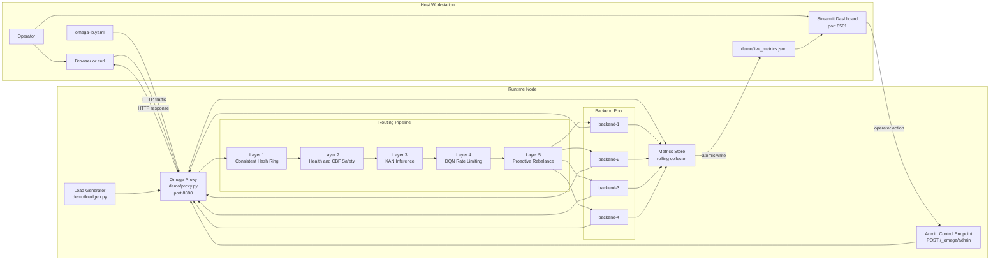
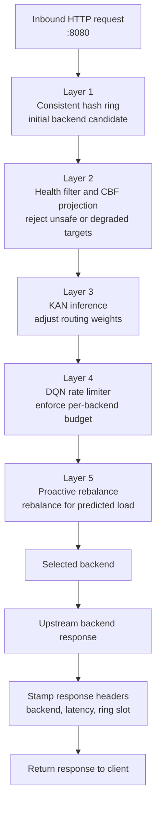
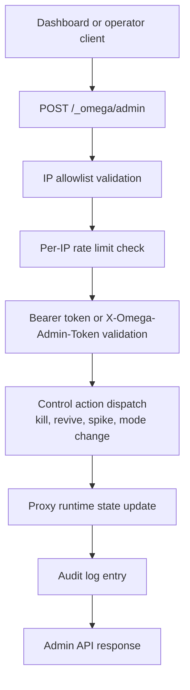
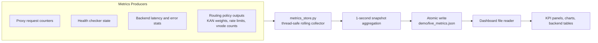

# Omega-LB Architecture Reference

This document describes the runtime architecture behind Omega-LB using source-controlled diagrams. It complements the screenshots in the README and separates the major system paths into request handling, administrative control, and metrics propagation.

## System Overview

## Request Flow

The request path is performance-critical. Each request enters on the proxy listener, is evaluated by each routing stage in order, and is then forwarded to the selected backend.

Operational notes:

- Layer 1 establishes the initial placement using the ring and virtual node layout.
- Layer 2 removes or de-weights targets that violate health or control-barrier constraints.
- Layers 3 to 5 refine the placement using learned policy, rate control, and forward-looking redistribution.

## Admin Control Flow

Administrative actions are isolated from the request data path. The dashboard and any operator tooling must pass three independent checks before a control action is applied.

Control-flow guarantees:

- Unauthorized callers are rejected before any backend mutation occurs.
- Rate-limited requests are logged with the rejection reason.
- Successful actions update runtime state and emit an audit trail.

## Metrics Flow

Metrics collection is asynchronous and out of band. The data plane updates counters and observations, and the dashboard consumes a file written atomically by the metrics store.

Metrics behavior:

- Writers do not block the request path on dashboard rendering.
- The dashboard can detect stale or missing files and degrade gracefully.
- File-based exchange keeps the dashboard loosely coupled from the proxy process.

## Runtime Boundaries

Omega-LB can run locally, inside a VM, or as part of a larger deployment. The key boundaries remain the same:

- The proxy owns the request path and routing pipeline.
- The dashboard is observational by default and only mutates runtime through the admin API.
- Metrics are exchanged through a persisted snapshot file, not direct in-memory coupling.

## Which File Should I Read First?

For new contributors, the fastest path into the codebase depends on what you are trying to understand.

| If you want to understand... | Start here | Then read |
| --- | --- | --- |
| Local request routing behavior | `demo/proxy.py` | `demo/metrics_store.py`, `dashboard/app.py` |
| Dashboard behavior and UI wiring | `dashboard/app.py` | `demo/live_metrics.json`, `demo/proxy.py` |
| Desktop app lifecycle and orchestration | `desktop/omegalb_desktop.py` | `desktop/build_macos.sh`, `desktop/build_windows.ps1` |
| Production control-plane startup | `controlplane/cmd/omegalb/main.go` | `controlplane/internal/daemon/daemon.go` |
| Health, failover, and circuit breaking | `controlplane/internal/health/checker.go` | `controlplane/internal/health/circuit_breaker.go` |
| Ring ownership and backend selection | `controlplane/internal/ring/ring.go` | `controlplane/internal/ring/reconcile.go`, `controlplane/internal/ring/wal.go` |
| eBPF program loading and attachment | `controlplane/internal/ebpf/loader.go` | `ebpf/kern/lb_policy.bpf.c`, `ebpf/kern/route_manager.bpf.c` |
| ML and routing policy logic | `controlplane/internal/rl/agent.go` | `ml/kan/kan_inference.py`, `ml/cbf/cbf_runtime.py` |
| Release packaging and desktop distribution | `releases/v1.0.0-alpha.1/RELEASE_SUMMARY.md` | `releases/v1.0.0-alpha.1/INSTALLATION.md`, `desktop/build_windows.ps1` |

Suggested reading order for most engineers:

1. `README.md` for product-level context and local workflow.
2. `docs/architecture.md` for runtime boundaries and component ownership.
3. `demo/proxy.py` for the easiest end-to-end request path.
4. `controlplane/internal/ring/` and `controlplane/internal/health/` for production routing behavior.
5. `controlplane/internal/ebpf/` and `ebpf/kern/` when you need kernel-path details.

## Component Responsibilities

The major runtime components are intentionally separated by responsibility.

| Component | Primary responsibility | Notes |
| --- | --- | --- |
| `demo/proxy.py` | Request ingress, routing decisions, admin action handling | Main user-space runtime for local and demo environments |
| `demo/backends.py` | Simulated backend services for testing and demonstration | Useful for local validation and screenshots |
| `demo/loadgen.py` | Synthetic traffic generation | Drives the request path during demos and benchmarks |
| `demo/metrics_store.py` | Metrics aggregation and atomic file snapshots | Decouples the dashboard from the proxy process |
| `dashboard/app.py` | Operator UI and visual telemetry | Reads snapshot file and calls admin endpoints |
| `desktop/omegalb_desktop.py` | Native desktop wrapper for local operations | Starts and manages the demo stack from a GUI |
| `controlplane/cmd/omegalb/main.go` | Control-plane daemon entrypoint | Production-oriented orchestration process |
| `controlplane/internal/health/checker.go` | Health probing and degradation detection | Feeds routing and failover decisions |
| `controlplane/internal/ring/*.go` | Ring ownership, reconciliation, WAL, affinity | Source of truth for backend distribution logic |
| `controlplane/internal/ebpf/loader.go` | eBPF program and map loading | Bridges user-space control to kernel-space data plane |
| `ebpf/kern/*.bpf.c` | Kernel-resident packet and routing programs | Production data plane implementation |
| `ml/*` | Learned policy training and inference support | KAN, CBF, PPO, and DQN-related modules |

## Ports and Interfaces

The main ports and interfaces exposed by the stack are listed below.

| Surface | Default | Purpose |
| --- | --- | --- |
| Proxy listener | `127.0.0.1:8080` | Main HTTP ingress for client traffic |
| Admin endpoint | `POST /_omega/admin` on proxy port | Runtime control actions from dashboard or operator tools |
| Status endpoint | `GET /_omega/status` on proxy port | Runtime status and health summary |
| Dashboard | `127.0.0.1:8501` | Streamlit operator UI |
| Metrics snapshot file | `demo/live_metrics.json` | File-based telemetry exchange |
| Desktop launcher | Local GUI process | Starts and supervises proxy, dashboard, and helpers |

## File-To-Runtime Mapping

The table below maps repository files and directories to the roles they play at runtime.

| Path | Runtime role |
| --- | --- |
| `omega-lb.yaml` | User-facing configuration source for proxy and dashboard setup |
| `start.sh` | Local orchestration entrypoint for quick-start environments |
| `demo/proxy.py` | Request-processing runtime |
| `demo/backends.py` | Demo backend process set |
| `demo/loadgen.py` | Local traffic generator |
| `demo/metrics_store.py` | Telemetry collection and snapshot writer |
| `dashboard/app.py` | Dashboard process |
| `desktop/build_macos.sh` | macOS packaging automation |
| `desktop/build_windows.ps1` | Windows packaging automation |
| `controlplane/internal/admin/server.go` | Administrative service surface in the control plane |
| `controlplane/internal/xds/server.go` | xDS control interface |
| `controlplane/internal/discovery/` | Backend discovery integration |
| `controlplane/internal/consensus/` | Multi-node state coordination |
| `controlplane/internal/fallback/nginx.go` | Fallback path when primary runtime mode is unavailable |
| `ebpf/kern/lb_policy.bpf.c` | Kernel load-balancing policy program |
| `ebpf/kern/metrics_collector.bpf.c` | Kernel-side metrics extraction |

## Startup Sequence

At a high level, a local runtime follows this sequence:

1. Load configuration from `omega-lb.yaml`.
2. Start backend processes if running in managed demo mode.
3. Start the proxy and initialize routing state.
4. Start metrics collection and begin writing `demo/live_metrics.json`.
5. Start the dashboard, which reads the metrics snapshot and exposes operator controls.

In production-oriented deployments, the control plane additionally loads eBPF programs, reconciles ring state, and wires health checking into the kernel data plane.

## Decision Ownership By Layer

The routing stack is easier to reason about when each layer is assigned a narrow decision boundary.

| Layer | Owns | Rejects or modifies |
| --- | --- | --- |
| Layer 1 | Stable backend candidate selection | Reassignment caused by ring placement changes |
| Layer 2 | Safety and health gating | Unsafe, overloaded, or degraded backends |
| Layer 3 | Learned policy weighting | Purely static placement assumptions |
| Layer 4 | Per-backend throughput budget | Excess traffic against constrained backends |
| Layer 5 | Forward-looking rebalance | Reactive-only distribution behavior |

## Operational Reading Guide

If you are debugging a specific class of problem, start in the component that owns that decision:

- Unexpected backend choice: inspect the ring and request-flow layers first.
- Healthy backends receiving no traffic: inspect safety gating, rate limits, and rebalance state.
- Dashboard looks stale: inspect `demo/live_metrics.json` generation before checking UI rendering.
- Admin controls appear ineffective: inspect the admin endpoint path and audit logs before changing dashboard code.

## Related References

- [README.md](../README.md)
- [RELEASE_NOTES.md](../RELEASE_NOTES.md)
- [releases/v1.0.0-alpha.1/INSTALLATION.md](../releases/v1.0.0-alpha.1/INSTALLATION.md)
